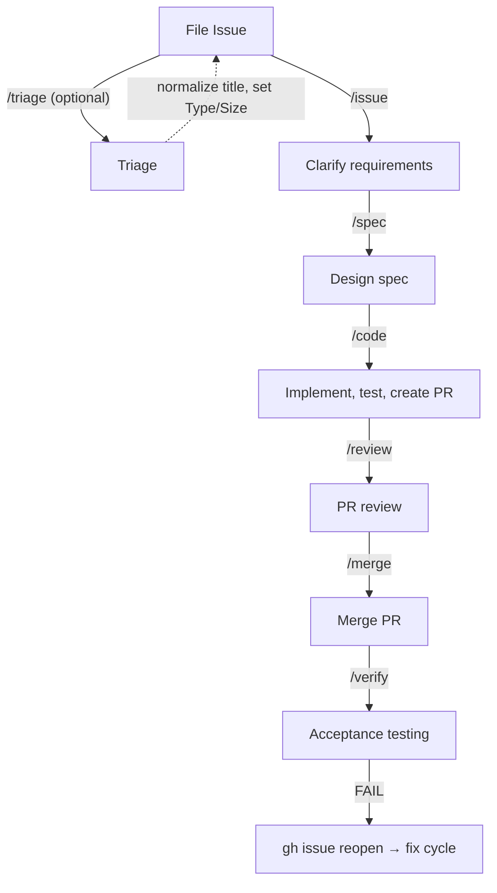

English | [日本語](README.ja.md)

# Wholework

Issue-driven Claude Code skills for autonomous GitHub workflows.

## Why Wholework

1. **Issue-to-spec design** — Issues define *what* and *when it's done*; specs break down *how* to get there. Verifiable acceptance criteria come first — and where possible, are checked automatically.
2. **Full-phase workflow with size-based routing** — `/issue → /spec → /code → /review → /merge → /verify` covers the entire lifecycle from requirements to post-merge verification.
3. **Autonomous execution** — `/auto` chains phases based on issue size and runs the full workflow without human intervention when you want it to.
4. **Works with what you have** — Runs on GitHub and Claude Code. Follows standard GitHub Flow; you can step in at any phase.
5. **Beyond software development** — Applies to any issue-driven project: websites, documentation, IaC, research, OSS operations.

## Install

```sh
/plugin marketplace add saitoco/wholework
/plugin install wholework@saitoco-wholework
```

Skills are available as `wholework:<skill-name>` (e.g., `/wholework:review`, `/wholework:code`).

For development setup, see [docs/structure.md](docs/structure.md#install).

## 🚀 Quick Start

New to Wholework? The [Quick Start Guide](docs/guide/quick-start.md) walks you through installing Wholework and running your first `/auto` command end-to-end in 10–15 minutes.

## 🔄 Workflow Overview

Wholework covers the full development lifecycle as a chain of independent skills:

```
/triage → /issue → /spec → /code → /review → /merge → /verify
```

Run each phase individually, or use `/auto` to chain them automatically. Size-based routing determines the workflow path: XS/S issues commit directly to main; M/L issues create a Pull Request; XL issues are split into sub-issues.



For a detailed guide to each command, see [docs/guide/workflow.md](docs/guide/workflow.md).

## 🛠️ Customization

Wholework works out of the box, and adapts to your project through three layers:

- **`.wholework.yml`** — Enable features like `opportunistic-verify`, set a `production-url`, or point to a custom `spec-path`
- **`.wholework/domains/`** — Inject project-specific instructions into individual skills (e.g., testing conventions, API patterns)
- **Adapters** — Replace or extend verify command handlers for your environment

See [docs/guide/customization.md](docs/guide/customization.md) for the full reference.

## Contributing

Contributions require a DCO sign-off on every commit. See [CONTRIBUTING.md](CONTRIBUTING.md) for details.

## License

Apache License 2.0. See [LICENSE](LICENSE).
