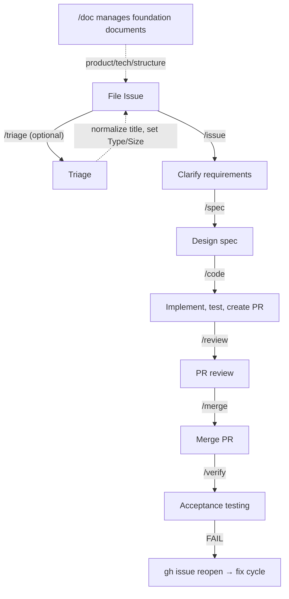

# 🔄 Workflow Overview

This page explains what each Wholework skill does, when to use it, and how issues flow through the system.

## The Six Phases



You can run each phase manually, or let `/auto` handle the sequence for you.

## Size Routing

Wholework uses a **Size** label (XS / S / M / L / XL) to decide how much process each issue needs.

| Size | Route | What happens |
|------|-------|--------------|
| XS, S | Patch (direct commit) | Code is committed directly to main — no PR needed |
| M, L | PR route | A pull request is created for review before merging |
| XL | Sub-issue split | The issue must be split into smaller sub-issues first |

Size is assigned during triage (manually or via `/triage`). If you run `/auto` on an unsized issue, Wholework will assign a size before proceeding.

## Skill Reference

### `/issue` — Clarify Requirements

Use when an issue description is vague or incomplete. Wholework interviews you and rewrites the issue body with clear acceptance criteria and verify commands.

```
/issue 42          # refine an existing issue
/issue "Add login" # create a new issue interactively
```

### `/spec` — Design the Implementation

Creates an implementation plan at `docs/spec/issue-N-*.md`. Reads the issue, investigates the codebase, and produces a step-by-step plan with verification methods.

```
/spec 42
```

You do not need to run `/spec` manually when using `/auto` — it runs automatically when needed.

### `/code` — Implement

Reads the spec and writes the code. For XS/S issues, commits directly to main. For M/L issues, creates a branch and pull request.

```
/code 42        # auto-detect route based on size
/code 42 --pr   # force PR route
```

### `/review` — Review the Pull Request

Runs acceptance criteria verification and multi-perspective code review on the PR. Must-fix findings are automatically corrected before proceeding.

```
/review 88      # review PR #88
```

For M-size issues, a lightweight single-agent review runs. For L-size, a full multi-agent review runs (spec compliance + bug detection).

### `/merge` — Merge the PR

Squash-merges the PR and deletes the remote branch.

```
/merge 88
```

### `/verify` — Acceptance Testing

Runs post-merge acceptance tests. Checks all verify commands, marks passing conditions, and reopens the issue if any condition fails (triggering a fix cycle).

```
/verify 42
```

### `/auto` — Full Automation

Chains all phases based on issue size. The most common way to run Wholework.

```
/auto 42               # run the full workflow
/auto 42 --patch       # force patch route (skip PR)
/auto --batch 5        # process 5 XS/S backlog issues in sequence
```

If no `phase/*` label is set, `/auto` starts from issue triage. If no spec exists, it runs `/spec` first.

## When to Use Each Approach

| Situation | Recommended |
|-----------|-------------|
| New issue, want full automation | `/auto N` |
| Issue already specced, want to implement | `/code N` |
| Want to refine a vague issue first | `/issue N`, then `/auto N` |
| Reviewing a PR someone else created | `/review PR_NUMBER` |
| Bulk-process small backlog issues | `/auto --batch 10` |

## Fix Cycle

If `/verify` fails, Wholework reopens the issue and adds a `fix-cycle` label. Running `/auto N` or `/code N` again detects this label and routes through patch regardless of size — keeping fix cycles fast.

## Further Reading

For internal skill behavior, label transitions, and developer-facing details, see [docs/workflow.md](../workflow.md).
