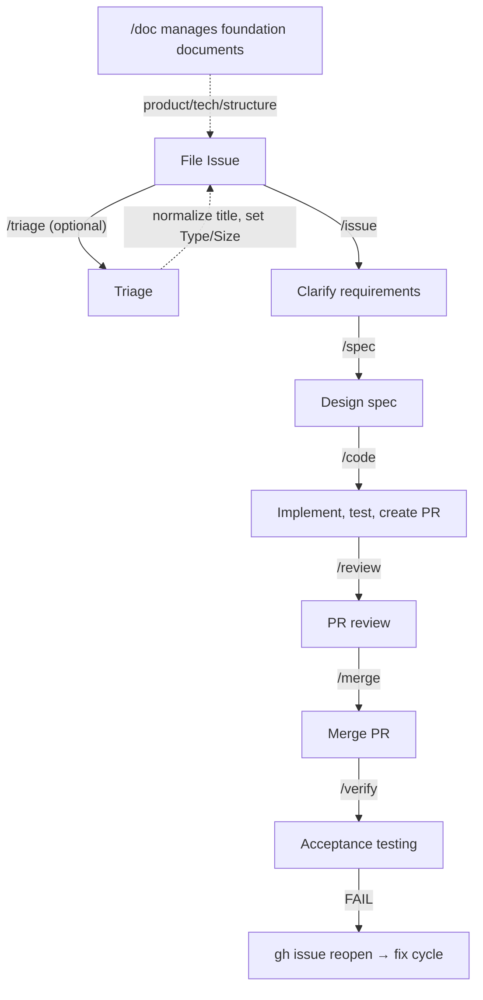

# 🔄 Workflow Overview

This page explains what each Wholework skill does, when to use it, and how issues flow through the system.

## The Six Phases



You can run each phase manually, or let `/auto` handle the sequence for you.

## Size Routing

Wholework uses a **Size** label (XS / S / M / L / XL) to decide how much process each issue needs.

| Size | Route | What happens |
|------|-------|--------------|
| XS, S | Patch (direct commit) | Code is committed directly to main — no PR needed |
| M, L | PR route | A pull request is created for review before merging |
| XL | Sub-issue split | The issue must be split into smaller sub-issues first |

Size is assigned during triage (manually or via `/triage`). If you run `/auto` on an unsized issue, Wholework will assign a size before proceeding.

## Skill Reference

### `/issue` — Clarify Requirements

Use when an issue description is vague or incomplete. Wholework interviews you and rewrites the issue body with clear acceptance criteria and verify commands.

```
/issue 42          # refine an existing issue
/issue "Add login" # create a new issue interactively
```

**Size-based depth**:

| Size | Behavior |
|------|----------|
| XS, S, M | Lightweight interview — up to 3 ambiguity points |
| L, XL | Deeper analysis — up to 5 ambiguity points, plus parallel sub-agent investigation of scope, risk, and precedents |
| XL | Additionally proposes sub-issue splitting when scope exceeds ~11 files or spans multiple independent features |

### `/spec` — Design the Implementation

Creates an implementation plan at `docs/spec/issue-N-*.md`. Reads the issue, investigates the codebase, and produces a step-by-step plan with verification methods.

```
/spec 42
/spec 42 --full   # force full depth regardless of size
/spec 42 --light  # force lightweight depth
```

You do not need to run `/spec` manually when using `/auto` — it runs automatically when needed.

**Size-based depth** (auto-selected; override with `--light`/`--full`):

| Size | Mode | Behavior |
|------|------|----------|
| XS, S, M | `--light` | 5-section lightweight spec; skips ambiguity resolution, uncertainty detection, and self-review |
| L | `--full` | Full codebase investigation, ambiguity resolution, self-review; uses Opus for design quality |
| XL | `--full` | Same as L; typically reached after sub-issue split |

### `/code` — Implement

Reads the spec and writes the code. For XS/S issues, commits directly to main. For M/L issues, creates a branch and pull request.

```
/code 42        # auto-detect route based on size
/code 42 --pr   # force PR route
/code 42 --patch # force patch route
```

**Size-based behavior**:

| Size | Behavior |
|------|----------|
| XS | Spec not required — skips the spec-existence check |
| XS, S | Patch route — direct commit to main, no PR |
| M, L | PR route — creates a branch and pull request for review |
| XL | Blocked — must be split into sub-issues via `/issue` first |

### `/review` — Review the Pull Request

Runs acceptance criteria verification and multi-perspective code review on the PR. Must-fix findings are automatically corrected before proceeding.

```
/review 88      # review PR #88
```

For M-size issues, a lightweight single-agent review runs. For L-size, a full multi-agent review runs (spec compliance + bug detection).

### `/merge` — Merge the PR

Squash-merges the PR and deletes the remote branch.

```
/merge 88
```

### `/verify` — Acceptance Testing

Runs post-merge acceptance tests. Checks all verify commands, marks passing conditions, and reopens the issue if any condition fails (triggering a fix cycle).

```
/verify 42
```

### `/auto` — Full Automation

Chains all phases based on issue size. The most common way to run Wholework.

```
/auto 42               # run the full workflow
/auto 42 --patch       # force patch route (skip PR)
/auto --batch 5        # process 5 XS/S backlog issues in sequence
```

If no `phase/*` label is set, `/auto` starts from issue triage. If no spec exists, it runs `/spec` first.

## Supporting Skills

These skills operate outside the main Issue → verify flow. They maintain metadata, foundation documents, and codebase health — you invoke them when the situation calls for it, rather than on every issue.

### `/triage` — Assign Metadata

Assigns Type (`bug` / `feature` / `task`), Size (XS–XL), and Priority to issues. Use when a new issue lacks metadata, or when you want Wholework to assess a backlog.

```
/triage 42            # triage a single issue
/triage               # bulk-triage untriaged issues
/triage --backlog     # bulk triage + 4-perspective deep analysis
```

`/auto` chains `/triage` automatically when an issue has no `phase/*` label, so you rarely need to run it standalone.

### `/doc` — Foundation Document Management

Manages Steering Documents (`docs/product.md`, `tech.md`, `structure.md`) and Project Documents under `docs/`. Run after significant project changes, or when onboarding Wholework into an existing repo.

```
/doc init              # wizard to create steering documents
/doc sync              # normalize existing docs and detect drift
/doc sync --deep       # include codebase analysis + .md integration scan
/doc add <path>        # register an existing .md as a project document
/doc translate ja      # generate Japanese translations of docs
```

### `/audit` — Drift and Fragility Detection

Detects gaps between documentation and implementation and automatically opens fix issues. Where `/doc sync` proposes *document-side* fixes, `/audit` proposes *code-side* fixes.

```
/audit drift           # semantic drift between steering docs and code
/audit fragility       # structural fragility (missing tests, convention violations)
/audit                 # both perspectives
/audit stats           # project health diagnostic report (throughput, backlog health)
```

Run periodically — for example, after a sprint or milestone — to keep docs, tests, and conventions aligned with the codebase.

## When to Use Each Approach

| Situation | Recommended |
|-----------|-------------|
| New issue, want full automation | `/auto N` |
| Want to design carefully before implementing | `/spec N`, then `/code N` |
| Issue already specced, want to implement | `/code N` |
| Want to refine a vague issue first | `/issue N`, then `/auto N` |
| Reviewing a PR someone else created | `/review PR_NUMBER` |
| Bulk-process small backlog issues | `/auto --batch 10` |

## Fixing After Verify Fails

If `/verify` fails, Wholework reopens the issue and removes all `phase/*` labels. Run `/code --patch N` to apply a small fix with a direct commit to main (Size unchanged), or `/code --pr N` for a larger fix with a new branch and PR. For cases requiring design changes, run `/spec N` to revisit the spec first.

## Further Reading

For internal skill behavior, label transitions, and developer-facing details, see [docs/workflow.md](../workflow.md).
