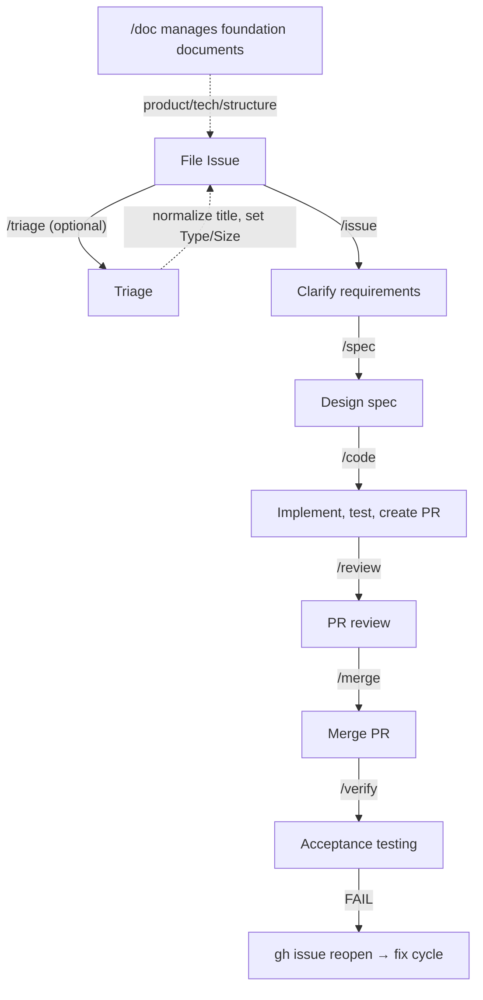

[English](../../guide/workflow.md) | 日本語

# 🔄 ワークフロー概要

本ページでは各 Wholework スキルの役割、使うタイミング、issue がシステム内をどう流れるかを説明します。

## 6 フェーズ



各フェーズを手動で実行することも、`/auto` にシーケンスを任せることもできます。

## サイズルーティング

Wholework は **Size** ラベル（XS / S / M / L / XL）を使って、各 issue にどれだけのプロセスが必要かを判断します。

| Size | 経路 | 挙動 |
|------|-------|--------------|
| XS、S | Patch（直接コミット） | コードは main に直接コミット — PR は不要 |
| M、L | PR 経路 | マージ前にレビュー用 pull request を作成 |
| XL | サブ issue 分割 | issue をまず小さなサブ issue に分割する必要あり |

Size は triage で付与されます（手動または `/triage`）。サイズ未設定の issue で `/auto` を実行すると、Wholework は先に進む前に Size を付与します。

## スキルリファレンス

### `/issue` — 要件明確化

issue 説明があいまいまたは不完全なときに使います。Wholework がインタビューを行い、明確な受入条件と verify command を備えた issue 本文に書き換えます。

```
/issue 42          # 既存 issue をリファイン
/issue "Add login" # 新規 issue を対話的に作成
```

**Size ベースの深度**:

| Size | 挙動 |
|------|----------|
| XS、S、M | 軽量インタビュー — あいまい点 3 件まで |
| L、XL | より深い分析 — あいまい点 5 件まで、加えてスコープ・リスク・前例の並列サブエージェント調査 |
| XL | さらに、スコープが約 11 ファイル超または複数の独立機能にまたがる場合にサブ issue 分割を提案 |

### `/spec` — 実装設計

`docs/spec/issue-N-*.md` に実装計画を作成します。issue を読み、コードベースを調査し、検証方法を含むステップごとの計画を生成します。

```
/spec 42
/spec 42 --full   # サイズに関わらずフル深度を強制
/spec 42 --light  # 軽量深度を強制
```

`/auto` を使う場合は手動で `/spec` を実行する必要はありません — 必要に応じて自動実行されます。

**Size ベースの深度**（自動選択、`--light`/`--full` で上書き）:

| Size | モード | 挙動 |
|------|------|----------|
| XS、S、M | `--light` | 5 セクション軽量 spec、あいまい解消・不確実性検出・セルフレビューをスキップ |
| L | `--full` | フルコードベース調査、あいまい解消、セルフレビュー、設計品質のため Opus を使用 |
| XL | `--full` | L と同じ、通常はサブ issue 分割後に到達 |

### `/code` — 実装

spec を読んでコードを書きます。XS/S issue は main に直接コミット。M/L issue はブランチと pull request を作成します。

```
/code 42        # サイズに基づいて経路を自動判定
/code 42 --pr   # PR 経路を強制
/code 42 --patch # patch 経路を強制
```

**Size ベースの挙動**:

| Size | 挙動 |
|------|----------|
| XS | spec 不要 — spec 存在チェックをスキップ |
| XS、S | Patch 経路 — main に直接コミット、PR なし |
| M、L | PR 経路 — レビュー用にブランチと pull request を作成 |
| XL | ブロック — まず `/issue` でサブ issue に分割が必要 |

### `/review` — Pull Request レビュー

PR の受入条件検証と多観点コードレビューを実行します。Must-fix 指摘は先に進む前に自動修正されます。

```
/review 88      # PR #88 をレビュー
```

M サイズ issue では軽量単一エージェントレビューが実行されます。L サイズではフルマルチエージェントレビュー（spec 準拠 + バグ検出）が実行されます。

### `/merge` — PR マージ

PR を squash merge してリモートブランチを削除します。

```
/merge 88
```

### `/verify` — 受入テスト

マージ後の受入テストを実行します。すべての verify command をチェックし、合格条件にマークし、どれか失敗すれば issue を reopen します（fix サイクル開始）。

```
/verify 42
```

### `/auto` — 完全自動化

issue のサイズに基づいて全フェーズを連鎖させます。最も一般的な Wholework 実行方法。

```
/auto 42               # フルワークフローを実行
/auto 42 --patch       # patch 経路を強制（PR をスキップ）
/auto --batch 5        # XS/S のバックログ issue を 5 件順次処理
```

`phase/*` ラベルが設定されていない場合、`/auto` は issue triage から開始します。spec が無い場合は先に `/spec` を実行します。

## Supporting Skills

これらのスキルはメイン Issue → verify フロー外で動作します。メタデータ、基盤ドキュメント、コードベース健全性を維持します — 個別の issue ごとにではなく、状況に応じて呼び出します。

### `/triage` — メタデータ付与

issue に Type（`bug` / `feature` / `task`）、Size（XS–XL）、Priority を付与します。新規 issue にメタデータが無いとき、または Wholework にバックログを評価させたいときに使います。

```
/triage 42            # 単一 issue の triage
/triage               # 未 triage の issue を一括 triage
/triage --backlog     # 一括 triage + 4 観点の深度分析
```

`/auto` は issue に `phase/*` ラベルが無い場合、自動で `/triage` を連鎖するので、単独で実行することは稀です。

### `/doc` — 基盤ドキュメント管理

Steering Documents（`docs/product.md`、`tech.md`、`structure.md`）と `docs/` 配下の Project Documents を管理します。大きなプロジェクト変更後、または既存リポジトリに Wholework を導入するときに実行します。

```
/doc init              # steering documents 作成ウィザード
/doc sync              # 既存ドキュメントを正規化しドリフトを検出
/doc sync --deep       # コードベース分析 + .md 統合スキャンを含む
/doc add <path>        # 既存 .md を project document として登録
/doc translate ja      # ドキュメントの日本語翻訳を生成
```

### `/audit` — ドリフト・フラジリティ検出

ドキュメントと実装のあいだのギャップを検出し、修正 issue を自動で開きます。`/doc sync` が *ドキュメント側* の修正を提案するのに対し、`/audit` は *コード側* の修正を提案します。

```
/audit drift           # steering docs とコードの意味的ドリフト
/audit fragility       # 構造的脆弱性（テスト欠如、規約違反）
/audit                 # 両観点
/audit stats           # プロジェクト健全性診断レポート（スループット、バックログ健全性）
```

定期的に実行 — 例えばスプリントやマイルストーン後 — してドキュメント、テスト、規約をコードベースに合わせて揃え続けます。

## 各アプローチの使い分け

| 状況 | 推奨 |
|-----------|-------------|
| 新規 issue で完全自動化したい | `/auto N` |
| 実装前に慎重に設計したい | `/spec N`、次に `/code N` |
| issue は既に spec 済み、実装したい | `/code N` |
| あいまいな issue を先にリファインしたい | `/issue N`、次に `/auto N` |
| 他人が作成した PR をレビュー | `/review PR_NUMBER` |
| 小さなバックログ issue を一括処理 | `/auto --batch 10` |

## Verify 失敗後の修正

`/verify` が失敗すると、Wholework は issue を reopen して全 `phase/*` ラベルを除去します。小さい修正を main 直接コミットで適用するには `/code --patch N` を実行（Size 据え置き）、新規ブランチと PR でより大きい修正には `/code --pr N` を実行します。設計変更を要するケースでは、先に `/spec N` で spec を見直します。

## さらに読む

スキル内部の挙動、ラベル遷移、開発者向け詳細は [docs/ja/workflow.md](../workflow.md) を参照してください。
