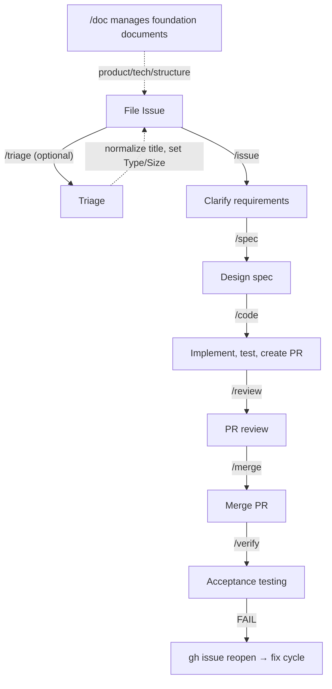

[English](../product.md) | 日本語

# Product

## ビジョン

Claude Code ユーザーに、Issue 作成からマージ後の検証までを含む Spec ファーストの開発ワークフローを、あらゆる GitHub プロジェクトで動作する組み合わせ可能な Skill セットとして提供する。すべてのフェーズ（issue → spec → code → review → merge → verify）は独立した Skill であり、段階的に導入でき、プロジェクトごとに設定可能で、アダプターを通じて拡張可能。

## ワークフロー概要

詳細: [docs/workflow.md](workflow.md)

## `/issue`（What）vs `/spec`（How）の責務境界

`/issue` と `/spec` は連続するワークフローフェーズですが、異なる抽象レベルで動作します。以下の表でそれぞれの責務を明確に分離しています。

| | `/issue`（What: 何を作るか） | `/spec`（How: どう作るか） |
|---|---|---|
| **記述するもの** | ユーザー向けの要件と振る舞い | 実装者向けの設計と技術的判断 |
| **例** | 受入条件、ユースケース、制約、背景 | 変更対象ファイル、実装ステップ、アーキテクチャの選択 |
| **禁止事項** | ファイルパス、関数名、実装ステップ、技術詳細 | 要件の追加・変更（要件は `/issue` で確定済み） |
| **出力** | 更新された Issue 本文 | Spec (`docs/spec/issue-N-*.md`) |

**判断基準**: 「コードベースを知らなくても理解できるか？」 — Yes → `/issue` の責務、No → `/spec` の責務。

## ターゲットユーザー

- GitHub と Claude Code を使って作業する人すべて — 開発者だけでなく、PM、デザイナー、テクニカルライター、Issue や PR を通じて作業を推進するあらゆるコントリビューターを含む

## Non-Goals

- main ブランチへの直接コミットとプッシュ（Spec ファイル、`/code --patch` による修正、`/doc translate {lang}` で生成された翻訳ドキュメントを除く）
- `/tmp/` 配下への一時ファイル作成（代わりにプロジェクト内の `.tmp/` を使用）
- SKILL.md 本文でコードフェンス外での半角 `!` 文字の使用

## 必須依存関係

Wholework が機能するために必要なハード依存関係:

- **Skills** — 各 Skill は Claude Code Plugin として実行
- **GitHub Issues** — ワークフローのエントリーポイントであり、要件の記録元
- **`docs/spec/`** — Spec の保存先。GitHub Issues と合わせて、ワークフローのコアを形成。Skill が不在の場合は自動的にディレクトリを作成

それ以外はすべてオプションであり、各 Skill はオプション依存が不在の場合にグレースフルにフォールバックします。

| オプション依存 | 不在時のフォールバック |
|---------------------|----------------------|
| Pull Requests | パッチ経路を使用（main への直接コミット）。XS/S サイズの Issue が対象 |
| Steering Documents (`docs/product.md` 等) | 参照ステップをスキップし、デフォルト動作で続行 |
| GitHub Projects ボード | Priority/Size のプロジェクトフィールド操作をスキップ。ラベルベースの操作（`phase/*` 等）は引き続き動作 |

この設計により、セットアップコストを最小限に抑え、チームがフルスタックにコミットすることなく個別のワークフローフェーズを採用できます。

> **Skill の実装ガイドライン**: オプション依存を使用する前に、必ず存在チェックを行うこと。不在の場合は、ステップをスキップするかデフォルト値で代替する。エラーで中断しないこと。

## 今後の方向性

- **`.wholework.yml` 設定カスタマイズ**: Spec の保存先（デフォルト: `docs/spec/`）などのパスをプロジェクトごとに設定可能にする。既存のディレクトリ構造を持つプロジェクトで Wholework を導入する際の摩擦を軽減。
- **ワークフロー最適化（3 軸）**: Agent Teams（並列エージェント連携）、Model selection（Skill/フェーズごとの異なるモデル）、Adaptive Thinking（動的な推論深度制御）を組み合わせ、ワークフローの品質・速度・コストを最適化。
- **コンテキスト分離戦略（コンテキスト劣化対策）**: Spec がフェーズ間のメモリとして機能するため、各 Skill は fork コンテキストでフェーズ間の情報を失わずに実行可能。実行フェーズの Skill を積極的に fork コンテキストで実行することで、コンテキスト劣化を防止。
  - **共有コンテキスト**（`/issue` + `/spec`）: 要件と設計を洗練するインタラクティブフェーズ。暗黙のコンテキスト（却下されたオプションの理由等）に価値があるため、コンテキストを共有。
  - **fork コンテキスト**（`/code`、`/review`、`/merge`、`/verify`）: 実行フェーズ。それぞれが Spec から必要な情報を読み取り、独立して実行。4 つの Skill すべてが fork コンテキストで動作。
  - **`/auto` ハイブリッドアプローチ**: `/auto` は各 Skill を `run-*.sh` 経由で `claude -p --dangerously-skip-permissions` として呼び出し、フェーズ間のコンテキスト分離と完全なパーミッションバイパスを保証。`/auto` 自体は軽量オーケストレーターとして機能し、情報は Spec を通じてのみ受け渡される。`phase/*` ラベルが未設定の場合は Issue のトリアージ/リファインから自動開始し、`phase/ready` がない場合は `/spec` を自動実行してから続行。`--batch N` はバックログから N 件の XS/S Issue を順次処理。XL Issue はサブ Issue の `blockedBy` 依存グラフを読み取り、独立したサブ Issue を並列実行（worktree 分離）し、依存するものはブロッカー完了後に順次実行。`--base {branch}` は main の代わりにリリースブランチをターゲットにする。
- **対象プロジェクトタイプの拡大**: 現在の主なユースケースはアプリケーションおよび Web 開発だが、「Issue → spec → 成果物 → レビュー」のフローが適用できるあらゆる GitHub プロジェクトへの汎用化を目指す。共通点: Issue で定義された要件、設計ドキュメント、成果物、レビューステップ。
  - **ドキュメント / コンテンツ**: 技術文書、API ドキュメント、翻訳プロジェクト、書籍執筆（GitBook スタイル）
  - **データ / リサーチ**: データ分析パイプライン、ML モデル開発、学術論文（LaTeX + Git）
  - **インフラ / IaC**: Terraform/Pulumi 定義、Kubernetes マニフェスト、CI/CD パイプライン構築
  - **OSS 運営**: RFC プロセス、CHANGELOG 管理、自動リリースノート
  - **ビジネス / 計画**: マーケティングキャンペーン管理、プロダクトロードマップ、法務文書
- **Progressive disclosure（Core/Domain 分離）**: Skill 本体に埋め込まれている専門コンテンツ（UI デザイン、Skill 開発等）を、関連プロジェクトでのみ読み込まれる補助ファイルに抽出。Core を軽量に保ちながら、ドメイン固有の拡張を実現。
- **Adapter パターンによるケイパビリティベースの拡張**: ツールアクセス（ブラウザ、CI、外部サービス）をアダプターレイヤーの背後に抽象化し、ケイパビリティの可用性に基づいて Skill の動作を切り替える。アダプターは 3 ステップ（検出 → コマンド変換 → 実行委譲）で動作し、プロジェクトローカル → ユーザーグローバル → バンドルの優先順位で解決。これにより Skill 本体を特定のツールから分離し、同じ Skill が異なる環境（Playwright の有無、CI 連携の有無等）で動作可能に。

<!-- ## Success Metrics (Optional)

Describe success metrics here. -->

## 競合 / 代替手段

### SDD フレームワーク / 方法論

| プロダクト | 性質 | Spec 駆動ワークフロー | レビュー/マージ | 配布形態 |
|---------|--------|---------------------|--------------|-------------|
| [GitHub Spec Kit](https://github.com/github/spec-kit) | Spec テンプレートと方法論 | Specify → Plan → Tasks | なし | CLI + テンプレート（22+ ツール） |
| [AWS Kiro](https://kiro.dev/) | IDE（VS Code フォーク） | requirements → design → tasks | 部分的 | スタンドアロン IDE |
| [Tessl](https://tessl.io/) | SDD プラットフォーム | spec → generate/describe → test | なし | フレームワーク（クローズドベータ）+ Spec Registry |
| [GSD](https://github.com/gsd-build/get-shit-done) | メタプロンプティング + コンテキストエンジニアリング | discuss → research → plan → execute → verify | なし | npm パッケージ（Claude Code/OpenCode/Gemini CLI） |
| [BMAD Method](https://github.com/bmad-code-org/BMAD-METHOD) | アジャイル AI 開発フレームワーク | analyst → PM → architect → SM → dev → QA | QA エージェント含む | npm パッケージ（21 エージェント、50+ ワークフロー） |
| [OpenSpec](https://github.com/Fission-AI/OpenSpec) | SDD フレームワーク | proposal → specs → design → tasks → apply | なし | npm パッケージ（20+ ツール） |
| [cc-sdd](https://github.com/gotalab/cc-sdd) | Kiro インスパイアツール | requirements → design → tasks → impl | なし | npm パッケージ（8 エージェント） |
| [Taskmaster AI](https://github.com/eyaltoledano/claude-task-master) | AI タスク管理 | PRD → parse → tasks.json → execute | なし | npm パッケージ + MCP サーバー（Cursor/Windsurf/Lovable/Roo/その他） |

### Claude Code Plugins / Skills

| プロダクト | 性質 | Spec 駆動ワークフロー | レビュー/マージ | 配布形態 |
|---------|--------|---------------------|--------------|-------------|
| [feature-dev](https://claude.com/plugins/feature-dev) | Anthropic 公式機能開発ワークフロー | Discovery → Codebase Exploration → Clarifying Questions → Architecture Design → Implementation → Quality Review（7 フェーズ） | code-reviewer 含む | Claude Code Plugin（131K+ インストール） |
| [Superpowers](https://github.com/obra/superpowers) | Skills フレームワーク | brainstorm → plan → implement | Code review skill 含む | Claude Code plugin |
| [Tsumiki](https://github.com/classmethod/tsumiki) | AI 駆動開発フレームワーク | requirements → design → tasks → implement（+ TDD） | なし | Claude Code Plugin |
| [claude-code-workflows](https://github.com/shinpr/claude-code-workflows) | E2E 開発プラグイン | analyze → design → plan → build → verify | recipe-* でレビュー | Claude Code Plugin（バックエンド/フロントエンド分離） |
| [claude-code-skills](https://github.com/levnikolaevich/claude-code-skills) | アジャイルパイプラインスイート | scope → stories → tasks → quality gate | マルチモデルレビュー（Claude+Codex+Gemini） | Claude Code Plugin（7 プラグイン） |
| [Simone](https://github.com/Helmi/claude-simone) | プロジェクト管理フレームワーク | ディレクトリベースのタスク管理 | なし | Claude Code + MCP サーバー |
| [CCPM](https://github.com/automazeio/ccpm) | GitHub Issue 連携 PM | PRD → epic → tasks → GitHub sync → parallel exec | PR ワークフロー含む | Claude Code Skills（worktree 並列実行） |
| [AgentSys](https://github.com/avifenesh/AgentSys) | ワークフロー自動化 | task → production, drift detection | マルチエージェントコードレビュー | Claude Code Plugin + agnix linter |
| [spec-workflow-mcp](https://github.com/Pimzino/spec-workflow-mcp) | MCP サーバー | Steering → Specs → Impl → Verify | 承認ワークフロー含む | MCP サーバー + ダッシュボード |
| [cc-blueprint-toolkit](https://github.com/croffasia/cc-blueprint-toolkit) | Blueprint 駆動 SDD プラグイン | Define → Architect → Build → Iterate (DABI) | なし | Claude Code Plugin（13 skills、8 agents） |

### GitHub ワークフローアシスタント / AI コードレビュー

| プロダクト | 性質 | 対象フェーズ | 配布形態 |
|---------|--------|-------------|-------------|
| [GitHub Agentic Workflows](https://github.blog/changelog/2026-02-13-github-agentic-workflows-are-now-in-technical-preview/) | GitHub 公式リポジトリ自動化 | Issue トリアージ、PR レビュー、CI 分析 | GitHub Actions（Markdown 定義、テクニカルプレビュー） |
| [GitHub Copilot Code Review](https://docs.github.com/copilot) | GitHub 公式 AI レビュー | PR レビュー | Copilot サブスクリプション |
| [CodeRabbit](https://coderabbit.ai/) | AI PR レビューサービス | PR レビュー（セキュリティ、ロジック、パフォーマンス） | SaaS（GitHub/GitLab/Bitbucket/Azure DevOps） |
| [Qodo PR-Agent](https://github.com/qodo-ai/pr-agent) | OSS PR レビューエージェント | /review, /improve, /ask | GitHub Actions / CLI（OSS + 有料） |
| [Graphite](https://graphite.dev/) | スタック PR + AI レビュー | PR 管理 → AI レビュー → merge queue | SaaS（GitHub のみ） |
| [Sweep](https://sweep.dev/) | AI GitHub issue → PR エージェント | Issue トリアージ → PR 作成 | GitHub App（OSS + 有料） |
| [Ellipsis](https://www.ellipsis.dev/) | AI PR レビュー + 自動修正 | PR レビュー | SaaS（GitHub/GitLab、YC W24） |

### 差別化サマリー

**Wholework の差別化ポイント**: GitHub Issues と PR を中心とした、Spec 作成からマージ後の検証までのエンドツーエンドワークフロー — Claude Code のネイティブ機能（Skills、CLAUDE.md）のみで実装。外部サービスや専用 IDE は不要。

他ツールとの主な違い:

- **フェーズ間メモリとしての Spec**: 多くの SDD ツールは Spec を「計画フェーズの成果物」として扱う。Wholework では、Spec は各フェーズからの実行結果（レトロスペクティブ）も蓄積し、ワークフロー全体のメモリとして機能する。
- **GitHub ネイティブ**: Issues/PR/Labels がワークフローの基盤 — 専用 IDE（Kiro のような）、タスク管理 JSON（Taskmaster のような）、独自ファイルシステム（GSD の `.planning/` や BMAD の `bmad/` のような）は不要。
- **Size ベースのルーティング**: XS〜XL の Size に基づいて patch/pr 経路、レビュー深度、Spec の粒度を自動調整する機能は他ツールにない。
- **マージ後の検証**: 独立した `/verify` フェーズによるマージ後の受入テストを持つツールは少ない。

## 用語集

| 用語 | 定義 | コンテキスト | 日本語訳 |
|------|------------|---------|---------|
| `/auto` | spec→code→review→merge→verify を `claude -p` で非インタラクティブに連鎖するオーケストレーター Skill。`phase/*` ラベル未設定時は Issue トリアージから自動開始し、`phase/ready` 未設定時は `/spec` を自動実行。`--batch N` はバックログから N 件の XS/S Issue を処理。XL Issue は独立サブ Issue を並列実行（worktree 分離）。`--base {branch}` はリリースブランチをターゲットにする。旧称 'Dispatch' | 開発ワークフロー | `/auto` |
| Acceptance condition | Issue の受入条件内の単一の検証可能な要件項目。チェックリストの 1 行として表示され、通常は verify command と対になる | /issue, /verify | 受入条件項目 |
| Acceptance criteria | Issue の受入条件の完全なセット。Issue 本文の `## Acceptance Criteria` 配下に定義。L1 は L2 の個別受入条件項目のコレクション | /issue, /verify | 受入条件 |
| auto-verify | `/verify` による自動検証プロセス。各受入条件の verify command を実行し、合格した条件をチェックし、失敗時は Issue を再オープン | /verify Skill | 自動検証 |
| Drift | 文書化された仕様（Steering Documents または Spec）と実際のコード実装の間の意味的な乖離。`/audit drift` で検出 | /audit Skill | ドリフト |
| Fork context | メインの会話に影響を与えない Skill 実行モード | Claude Code | fork コンテキスト |
| Patch route | XS/S サイズの Issue 向けワークフロー経路。Pull Request を作成せず main ブランチに直接コミット | 開発ワークフロー | パッチ経路 |
| Phase label | `phase/*` GitHub ラベル（例: `phase/issue`、`phase/spec`、`phase/ready`、`phase/code`）。Issue の現在のワークフロー段階を示す | 開発ワークフロー | フェーズラベル |
| PR route | M/L サイズの Issue 向けワークフロー経路。マージ前にコードレビュー用の Pull Request を作成 | 開発ワークフロー | PR 経路 |
| Project Documents | プロジェクトのワークフローおよび運用手順ドキュメント。`docs/` 配下に格納 | /doc Skill | Project Documents |
| Retrospective | 各 Skill 実行後に Spec に追記されるセクション。そのフェーズからの観察、判断、不確実性の解消を記録。ワークフローフェーズ全体の実行履歴を蓄積 | 開発ワークフロー | レトロスペクティブ |
| Shared module | `modules/*.md` に格納され、「Read and follow」パターンで複数の Skill から参照される手順ドキュメント。旧称「共有手順ドキュメント」 | Skill 開発 | 共有モジュール |
| Size | トリアージ時に割り当てられる複雑さ/工数の見積もり（XS/S/M/L/XL）。ワークフロー経路（patch vs. PR）と Spec の深度を決定 | /triage Skill | サイズ |
| Skill | Claude Code の拡張機能。処理ステップは `skills/<n>/SKILL.md` に記述され、`/<n>` で呼び出される | Claude Code | スキル |
| Spec | `/spec` で作成される実装計画ドキュメント。`docs/spec/issue-N-short-title.md` に格納。**各 Skill 実行後にレトロスペクティブも蓄積され、ワークフローのフェーズ間メモリとして機能**。旧称 'Design file' / 'Issue Spec' | 開発ワークフロー | Spec |
| Steering Documents | 基盤ドキュメント（product/tech/structure）の総称。`docs/` 配下に格納 | /doc Skill | Steering Documents |
| Sub-agent | Task ツールで生成されるサブエージェント。結果のみをメインエージェントに返す | Claude Code | サブエージェント |
| Sub-issue | XL Issue の分解における子 Issue。`/auto` は `blockedBy` 依存グラフを読み取り、独立したサブ Issue を並列実行（worktree 分離）し、依存するものはブロッカー完了後に順次実行 | 開発ワークフロー | サブ Issue |
| verify command | `<!-- verify: ... -->` 形式の HTML コメント。受入条件に機械検証方法を付与。旧称「verification hint / Acceptance check」 | /issue, /verify | verify command |
| verify command type | verify command の最初のトークン（例: `file_exists`、`grep`、`section_contains`、`command`）。受入条件に適用するチェック方法を識別 | /issue, /verify | verify command タイプ |
