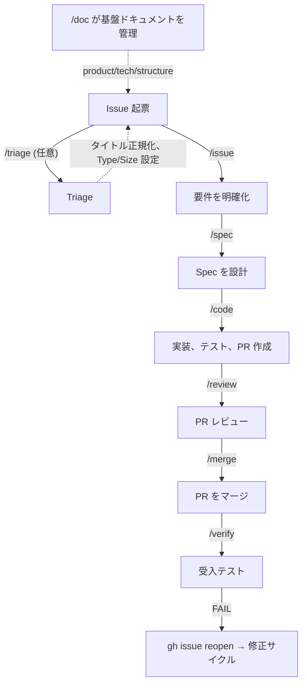

# Product

## Vision

Claude Code ユーザ向けに、Issue 作成からマージ後の検証までを含む Spec ファーストの開発ワークフローを、あらゆる GitHub プロジェクトで動作する組み合わせ可能な Skill 群として提供します。各フェーズ（issue → spec → code → review → merge → verify）は独立した Skill であり、段階的に導入し、プロジェクト単位で設定し、アダプタによって拡張できます。

## ワークフロー概要

詳細: [docs/workflow.md](workflow.md)

## `/issue`（What）vs `/spec`（How）の責務境界

`/issue` と `/spec` はワークフロー上で連続するフェーズですが、異なる抽象レベルで動作します。以下の表は両者の責務を明確に分離するものです。

| | `/issue`（What: 何を作るか） | `/spec`（How: どう作るか） |
|---|---|---|
| **記述内容** | ユーザ向けの要件と振る舞い | 実装者向けの設計と技術的決定 |
| **例** | 受入条件、ユースケース、制約、背景 | 変更対象ファイル、実装ステップ、アーキテクチャ選択 |
| **禁止事項** | ファイルパス、関数名、実装ステップ、技術的詳細 | 要件の追加や変更（要件は `/issue` で確定） |
| **アウトプット** | 更新された Issue 本文 | Spec（`docs/spec/issue-N-*.md`） |

**判断ルール**: 「コードベースを知らずに理解できるか？」— Yes → `/issue` の責務、No → `/spec` の責務。

## 対象ユーザ

- Claude Code を使って GitHub 上で作業するすべての人 — 開発者だけでなく、PM、デザイナー、テクニカルライター、その他 Issue と PR を通じて作業を進めるすべての参加者

## Non-Goals

- main ブランチへの直接コミット・プッシュ（Spec ファイル、`/code --patch` の修正、`/doc translate` が生成する翻訳ドキュメントを除く）
- `/tmp/` 配下への一時ファイル作成（代わりにプロジェクト内の `.tmp/` を使用）
- SKILL.md 本文中のコードフェンス外における半角 `!` 文字の使用

## 必須依存

Wholework が動作するために必須となる依存は以下のみです:

- **Skills** — Claude Code Plugin として実行される各 Skill
- **GitHub Issues** — ワークフローの起点であり、要件の記録ソース
- **`docs/spec/`** — Spec の保存先。GitHub Issues と併せてワークフローの中核を成します。ディレクトリがない場合は Skill が自動的に作成します。

それ以外はすべて任意で、各 Skill は任意依存が存在しない場合もグレースフルにフォールバックします。

| 任意依存 | 不在時のフォールバック |
|----------|------------------------|
| Pull Requests | patch 経路（main への直接コミット）を使用。XS/S サイズの Issue が対象 |
| Steering Documents（`docs/product.md` など） | 参照ステップをスキップし、デフォルト動作で続行 |
| GitHub Projects ボード | Priority/Size の Projects フィールド操作をスキップ。ラベルベースの操作（`phase/*` など）は引き続き動作 |

この設計はセットアップコストを最小化し、フルスタックへのコミット不要で個々のワークフローフェーズを導入可能にします。

> **Skill 実装ガイドライン**: 任意依存を使用する前に必ず存在確認を行うこと。不在時はステップをスキップするかデフォルト値で代替すること。エラー終了させないこと。

## 今後の方向性

- **`.wholework.yml` 設定のカスタマイズ**: Spec の保存先（デフォルト: `docs/spec/`）などのパスをプロジェクトごとに設定可能にします。これにより既存のディレクトリ構造を持つプロジェクトへの導入時の摩擦を減らせます。
- **ワークフローの最適化（3 軸）**: Agent Teams（エージェントの並列協調）、Model selection（Skill/フェーズごとのモデル切替）、Adaptive Thinking（動的な推論深度制御）を組み合わせ、ワークフローの品質・速度・コストを最適化します。
- **コンテキスト分離戦略（コンテキストロット対策）**: Spec がフェーズを跨ぐメモリとして機能するため、各 Skill はフェーズ間の情報を失うことなくフォークコンテキストで実行できます。実行フェーズの Skill を積極的にフォークコンテキスト化することで、コンテキストロットを防ぎます。
  - **共有コンテキスト**（`/issue` + `/spec`）: 要件と設計を対話的に練り上げるフェーズ。暗黙的なコンテキスト（却下された選択肢の理由など）に価値があるため、コンテキストを共有します。
  - **フォークコンテキスト**（`/code`、`/review`、`/merge`、`/verify`）: 実行フェーズ。それぞれが Spec から必要な情報を読み取り、独立して動作します。4 つの Skill すべてがフォークコンテキストで動作します。
  - **`/auto` ハイブリッドアプローチ**: `/auto` は各 Skill を `run-*.sh` 経由で `claude -p --dangerously-skip-permissions` として呼び出すため、フェーズ間のコンテキスト分離とパーミッション完全バイパスが保証されます。`/auto` 自身は軽量なオーケストレータとして振る舞い、情報は Spec を通じてのみ受け渡されます。`phase/*` ラベルがない場合は Issue の triage/精査から自動開始し、`phase/ready` がない場合は `/spec` を自動実行してから進行します。`--batch N` はバックログから XS/S の Issue を N 件順に処理します。XL Issue はサブ Issue の `blockedBy` 依存グラフを読み取り、独立なサブ Issue を並列実行（worktree 分離）、依存先完了後に後続サブ Issue を順次実行します。`--base {branch}` は main の代わりにリリースブランチを対象とします。
- **対象プロジェクト種別の拡張**: 現在の主要ユースケースはアプリケーション・Web 開発ですが、「Issue → spec → 成果物 → review」の流れが適用できる GitHub プロジェクト全般への一般化を目標とします。共通項は Issue で定義される要件、設計ドキュメント、成果物、レビューステップです。
  - **ドキュメント / コンテンツ**: 技術文書、API ドキュメント、翻訳プロジェクト、書籍執筆（GitBook スタイル）
  - **データ / リサーチ**: データ分析パイプライン、ML モデル開発、学術論文（LaTeX + Git）
  - **インフラ / IaC**: Terraform/Pulumi 定義、Kubernetes マニフェスト、CI/CD パイプラインのセットアップ
  - **OSS 運営**: RFC プロセス、CHANGELOG 管理、リリースノート自動化
  - **業務 / プランニング**: マーケティングキャンペーン管理、プロダクトロードマップ、法務文書
- **特化コンテンツの段階的開示（Core/Domain 分離）**: 現在 Skill 本文に埋め込まれている特化コンテンツ（UI デザイン、Skill 開発など）を、関連するプロジェクトでのみ読み込まれる補助ファイルに分離します。これにより Core を軽量に保ちつつ、ドメイン固有の拡張を可能にします。
- **ケイパビリティベース拡張のアダプタパターン**: ツールアクセス（ブラウザ、CI、外部サービス）をアダプタ層の背後に抽象化し、ケイパビリティの可用性に応じて Skill の挙動を切り替えます。アダプタは 3 ステップ（検出 → コマンド変換 → 実行委譲）で動作し、優先順（project-local → user-global → bundled）に解決します。これにより Skill 本体を特定のツールから切り離し、異なる環境（Playwright の有無、CI 連携の有無など）で同じ Skill を動作させます。

<!-- ## Success Metrics (Optional)

Describe success metrics here. -->

## 競合 / 代替

### SDD フレームワーク / 方法論

| プロダクト | 性質 | Spec 駆動ワークフロー | レビュー/マージ | 配布形態 |
|------------|------|----------------------|-----------------|----------|
| [GitHub Spec Kit](https://github.com/github/spec-kit) | Spec テンプレートと方法論 | Specify → Plan → Tasks | なし | CLI + テンプレート（22+ ツール） |
| [AWS Kiro](https://kiro.dev/) | IDE（VS Code フォーク） | requirements → design → tasks | 部分的 | スタンドアロン IDE |
| [Tessl](https://tessl.io/) | SDD プラットフォーム | spec → generate/describe → test | なし | フレームワーク（クローズドベータ）+ Spec Registry |
| [GSD](https://github.com/gsd-build/get-shit-done) | メタプロンプト + コンテキストエンジニアリング | discuss → research → plan → execute → verify | なし | npm パッケージ（Claude Code/OpenCode/Gemini CLI） |
| [BMAD Method](https://github.com/bmad-code-org/BMAD-METHOD) | アジャイル AI 開発フレームワーク | analyst → PM → architect → SM → dev → QA | QA エージェント含む | npm パッケージ（21 エージェント、50+ ワークフロー） |
| [OpenSpec](https://github.com/Fission-AI/OpenSpec) | SDD フレームワーク | proposal → specs → design → tasks → apply | なし | npm パッケージ（20+ ツール） |
| [cc-sdd](https://github.com/gotalab/cc-sdd) | Kiro 由来のツール | requirements → design → tasks → impl | なし | npm パッケージ（8 エージェント） |
| [Taskmaster AI](https://github.com/eyaltoledano/claude-task-master) | AI タスク管理 | PRD → parse → tasks.json → execute | なし | npm パッケージ + MCP サーバ（Cursor/Windsurf/Lovable/Roo/その他） |

### Claude Code Plugins / Skills

| プロダクト | 性質 | Spec 駆動ワークフロー | レビュー/マージ | 配布形態 |
|------------|------|----------------------|-----------------|----------|
| [feature-dev](https://claude.com/plugins/feature-dev) | Anthropic 公式の機能開発ワークフロー | Discovery → Codebase Exploration → Clarifying Questions → Architecture Design → Implementation → Quality Review（7 フェーズ） | code-reviewer 含む | Claude Code Plugin（131K+ インストール） |
| [Superpowers](https://github.com/obra/superpowers) | Skills フレームワーク | brainstorm → plan → implement | コードレビュー Skill 含む | Claude Code plugin |
| [Tsumiki](https://github.com/classmethod/tsumiki) | AI 駆動開発フレームワーク | requirements → design → tasks → implement（+ TDD） | なし | Claude Code Plugin |
| [claude-code-workflows](https://github.com/shinpr/claude-code-workflows) | E2E 開発 plugin | analyze → design → plan → build → verify | recipe-* でレビュー | Claude Code Plugin（backend/frontend 分離） |
| [claude-code-skills](https://github.com/levnikolaevich/claude-code-skills) | アジャイルパイプラインスイート | scope → stories → tasks → quality gate | マルチモデルレビュー（Claude+Codex+Gemini） | Claude Code Plugin（7 plugin） |
| [Simone](https://github.com/Helmi/claude-simone) | プロジェクト管理フレームワーク | ディレクトリベースのタスク管理 | なし | Claude Code + MCP サーバ |
| [CCPM](https://github.com/automazeio/ccpm) | GitHub Issue 統合型 PM | PRD → epic → tasks → GitHub sync → 並列実行 | PR ワークフロー含む | Claude Code Skills（worktree 並列実行） |
| [AgentSys](https://github.com/avifenesh/AgentSys) | ワークフロー自動化 | task → production、ドリフト検出 | マルチエージェントコードレビュー | Claude Code Plugin + agnix linter |
| [spec-workflow-mcp](https://github.com/Pimzino/spec-workflow-mcp) | MCP サーバ | Steering → Specs → Impl → Verify | 承認ワークフロー含む | MCP サーバ + ダッシュボード |
| [cc-blueprint-toolkit](https://github.com/croffasia/cc-blueprint-toolkit) | ブループリント駆動 SDD plugin | Define → Architect → Build → Iterate（DABI） | なし | Claude Code Plugin（13 skill、8 エージェント） |

### GitHub ワークフローアシスタント / AI コードレビュー

| プロダクト | 性質 | 対象フェーズ | 配布形態 |
|------------|------|--------------|----------|
| [GitHub Agentic Workflows](https://github.blog/changelog/2026-02-13-github-agentic-workflows-are-now-in-technical-preview/) | GitHub 公式のリポジトリ自動化 | Issue トリアージ、PR レビュー、CI 分析 | GitHub Actions（Markdown 定義、technical preview） |
| [GitHub Copilot Code Review](https://docs.github.com/copilot) | GitHub 公式 AI レビュー | PR レビュー | Copilot サブスクリプション |
| [CodeRabbit](https://coderabbit.ai/) | AI PR レビューサービス | PR レビュー（セキュリティ、ロジック、パフォーマンス） | SaaS（GitHub/GitLab/Bitbucket/Azure DevOps） |
| [Qodo PR-Agent](https://github.com/qodo-ai/pr-agent) | OSS PR レビューエージェント | /review、/improve、/ask | GitHub Actions / CLI（OSS + 有料） |
| [Graphite](https://graphite.dev/) | スタック型 PR + AI レビュー | PR 管理 → AI レビュー → マージキュー | SaaS（GitHub のみ） |
| [Sweep](https://sweep.dev/) | AI GitHub issue → PR エージェント | Issue トリアージ → PR 作成 | GitHub App（OSS + 有料） |
| [Ellipsis](https://www.ellipsis.dev/) | AI PR レビュー + 自動修正 | PR レビュー | SaaS（GitHub/GitLab、YC W24） |

### 差別化まとめ

**Wholework の差別化ポイント**: Spec の執筆からマージ後の検証まで、GitHub の Issue と PR を中心に据えたエンドツーエンドのワークフローを、Claude Code のネイティブ機能（Skills、CLAUDE.md）のみで実装しています。外部サービスや専用 IDE は不要です。

他ツールとの主要な違い:

- **Spec をフェーズ横断のメモリとして活用**: 多くの SDD ツールは Spec を「計画フェーズの成果物」として扱いますが、Wholework では各フェーズの実行結果（retrospective）も Spec に蓄積され、ワークフロー全体を貫くメモリとして機能します。
- **GitHub ネイティブ**: Issue/PR/ラベルがワークフローの骨格であり、専用 IDE（Kiro のような）、タスク管理 JSON（Taskmaster のような）、独自ファイルシステム（GSD の `.planning/`、BMAD の `bmad/` のような）は不要です。
- **Size ベースのルーティング**: XS–XL の Size に応じて patch/pr 経路、レビュー深度、Spec 粒度を自動調整する仕組みは他のツールには見られません。
- **マージ後検証**: マージ後の独立した受入テスト用に専用の `/verify` フェーズを持つツールはほとんどありません。

## Terms

<!-- public: terms exposed to end users / internal: implementation terms for developers -->

### Public Terms（ユーザ向け）

| 用語 | 定義 | 文脈 |
|------|------|------|
| Skill | Claude Code の拡張機能。処理ステップは `skills/<n>/SKILL.md` に記述され、`/<n>` で呼び出される | Claude Code |
| Spec | `/spec` が作成する実装計画ドキュメント。`docs/spec/issue-N-short-title.md` に保存される。**各 Skill 実行後の retrospective（実行ログ）も記録される** — Skill 実行前に Spec を参照すると、過去の実行履歴を確認できる | 開発ワークフロー |
| `/auto` | spec→code→review→merge→verify を `claude -p` 経由で非対話的に連鎖させるオーケストレータ Skill。`phase/*` ラベルがない場合は Issue の triage から自動開始、`phase/ready` がない場合は `/spec` を自動実行。`--batch N` はバックログから XS/S の Issue を N 件処理、XL Issue は独立サブ Issue を並列実行（worktree 分離）。`--base {branch}` はリリースブランチを対象にする | 開発ワークフロー |
| 受入チェック | `<!-- verify: ... -->` 形式の HTML コメント。受入条件に機械的に検証可能な方法を付与する。旧称「verification hint」 | /issue、/verify |

### Internal Terms（開発者向け）

| 用語 | 定義 | 文脈 |
|------|------|------|
| Steering Documents | 基盤ドキュメント（product/tech/structure）の総称。`docs/` 配下に保存される | /doc Skill |
| Project Documents | プロジェクトのワークフローや運用手順のドキュメント。`docs/` 配下に保存される | /doc Skill |
| フォークコンテキスト | メイン会話に影響を与えない Skill 実行モード | Claude Code |
| 共有モジュール | `modules/*.md` に保存される手順ドキュメント。複数の Skill から "Read and follow" パターンで参照される。旧称「共有手順ドキュメント」 | Skill 開発 |
| サブエージェント | Task ツールで起動されるサブエージェント。結果のみをメインエージェントに返す | Claude Code |
