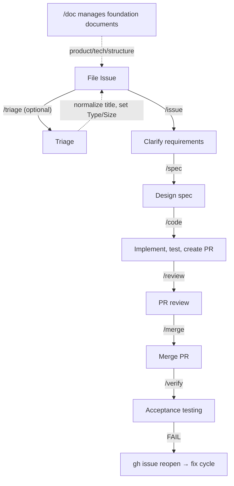

[English](../workflow.md) | 日本語

# 開発ワークフロー

## 概要

Claude Code Skills を使った開発ワークフローの概要。



メインフローは `/issue` → `/spec` → `/code` → `/review` → `/merge` → `/verify`。`/auto` は Issue のサイズとラベルに基づいてこれらのフェーズを自動で連鎖させます。ルーティングの詳細は [Orchestration](#orchestration) を参照してください。

**サイズベースのルーティング**: Issue の Size プロパティがワークフロー経路を決めます（patch vs PR、レビュー深度、spec 深度）。判断テーブル（Size 決定の 2 軸基準 + Size→ワークフローのマッピング）は [`modules/size-workflow-table.md`](../../modules/size-workflow-table.md) を参照してください。

main ブランチ保護ルール: [CLAUDE.md](../../CLAUDE.md) を参照。

## Core Phases

メインワークフローの 6 フェーズ。各フェーズは独立したスキルとして実装されます。スキル内部の挙動は `skills/<name>/SKILL.md` を参照してください。本セクションでは各フェーズの役割と位置付けのみを扱います。

### 1. `/issue` — Issue 作成

Issue の要件を明確化します。2 つのモード: 新規作成（`/issue "title"`）と既存リファイン（`/issue 123`）。あいまいさ検出、受入条件の分類、verify command 付与、サブ issue 分割を実行します。`triaged` ラベルの無い既存 Issue をリファインする場合は triage 実行を自動連鎖します — 単独 Issue では 1 回の `/issue` で triage + issue 作成の両方が完了します。詳細: [`skills/issue/SKILL.md`](../../skills/issue/SKILL.md)

**`/issue` と `/spec` の責務境界**: [docs/ja/product.md — 責務境界テーブル](product.md#spec-design-boundary)

### 2. `/spec` — 仕様策定

Issue 要件からコードベースを調査し Spec（`docs/spec/issue-N-short-title.md`）を作成します。設計完了時に Size→ワークフローのルーティングを行い、Size に基づいて次アクション（`/code --patch` / `/code`）を提示します。`--light` は軽量設計（あいまいさ解消、不確実性検出、セルフレビューなどを省略）、`--full` はフル設計。オプション省略時は Size ラベルから自動判定します（M → `--light`、L/XL → `--full`）。詳細: [`skills/spec/SKILL.md`](../../skills/spec/SKILL.md)

### 3. `/code` — 実装

Spec に基づいて設計を実装します。サイズベースのルーティング: XS/S → **patch**（main 直接コミット、PR なし）、M/L → **pr**（ブランチ + PR）。XS は spec 存在チェックをスキップします。`--patch`/`--pr` フラグを明示すると自動判定を上書きできます。

3 つの実装経路:
- **Claude Code**: `/code 123` でローカル実装
- **GitHub Copilot**: Issue で "Assign to Copilot" を選択
- **手動**: ユーザーが手動で実装

**Spec 参照**: 実装時は `docs/spec/issue-N-short-title.md` に保存された Spec を参照します。Spec には対象ファイル、実装手順、検証方法が含まれます。Spec が存在しない場合は Issue 本文から要件を読み取ります。

詳細: [`skills/code/SKILL.md`](../../skills/code/SKILL.md)

### 4. `/review` — レビュー

PR の受入条件検証、多観点コードレビュー、issue 解決を統合します。MUST 指摘は `/merge` 前に自動修正されます。詳細: [`skills/review/SKILL.md`](../../skills/review/SKILL.md)

**Review モード**: Size に基づいて自動判定（Project フィールド優先 → label フォールバック）。`--light`/`--full` で明示指定も可能です。

| Size | Review mode | 挙動 |
|------|-------------|----------|
| XS, S | skip（early exit） | "レビュー不要" メッセージで終了（patch 経路） |
| M | light | Step 10 を軽量統合レビュー（1 agent）として実行 |
| L, XL | full | 全ステップ実行 |

**外部レビューツール連携**: プロジェクトルートに `.wholework.yml` を作成し値を設定して有効化します（デフォルトは全て無効）:

```yaml
# .wholework.yml
copilot-review: true        # GitHub Copilot review を有効化（Step 7 で待機・指摘対応）
claude-code-review: true    # 公式 Claude Code Review を有効化（Step 7 で待機・指摘対応）
coderabbit-review: true     # CodeRabbit AI review を有効化（Step 7 で待機・指摘対応）
review-bug: false           # Step 9 の review-bug agent を無効化（review-spec のみ実行）
```

`.wholework.yml` が存在しない場合、全設定はデフォルト（無効）として扱われます。

**`--review-only` オプション**: `/review {PR 番号} --review-only` は多観点コードレビュー（Step 10）で停止し、Steps 11–14 とレトロスペクティブをスキップします。修正はユーザーまたは Copilot に委譲します。`phase/review` ステータスラベルはそのまま残ります。

### 5. `/merge` — マージ

squash merge を実行してリモートブランチを削除します。コンフリクトがある場合は自動解決を試みます。詳細: [`skills/merge/SKILL.md`](../../skills/merge/SKILL.md)

### 6. `/verify` — 受入テスト

マージ後の受入条件を自動検証します。全条件 PASS でフロー完了、FAIL では `gh issue reopen` で fix サイクルへ戻ります。全フェーズのフェーズ横断レトロスペクティブレビューを行い、コード改善については常に Issue を作成、スキル基盤（Wholework）改善については `.wholework.yml` に `skill-proposals: true` がある場合のみ Issue を作成します。詳細: [`skills/verify/SKILL.md`](../../skills/verify/SKILL.md)

## Orchestration

### `/auto` — フルワークフロー自動化

Core Phases を順次連鎖させるオーケストレーター。各フェーズは独立した `claude -p --dangerously-skip-permissions` プロセスとして実行され、コンテキスト分離を保証します。`/auto 123 [--patch|--pr] [--review=full|--review=light]` で Size ベースのルーティングを含む E2E ワークフローを駆動します:

- **patch XS/S**: spec（必要時）→ code → verify
- **pr M/L**: spec（必要時）→ code → review（M → `--light`、L → `--full`）→ merge → verify
- **XL**: サブ issue 依存グラフ（`blockedBy`）を読み、独立サブ issue を並列実行（worktree 分離）し、依存先はブロッカー完了後に順次実行。`/auto` は各サブ issue の spec を自動実行する

`phase/ready` が無い場合 `/auto` は `/spec` を先に自動実行します。`phase/*` ラベルが全く設定されていない場合は issue triage/refinement から始めます。詳細: [`skills/auto/SKILL.md`](../../skills/auto/SKILL.md)

**`--batch N`**: バックログから新しい順に N 個の XS/S Issue を一括処理します。

**リリースブランチワークフロー（`--base` オプション）**: 複数の Issue の変更をリリースブランチ（例: `release/v2.0`）に集約してから main にマージする際に `--base` を使用します。

```
# リリースブランチを作成
git checkout -b release/v2.0 main
git push origin release/v2.0

# release/v2.0 をベースに各 Issue を実装
/code 123 --base release/v2.0
/auto 124 --base release/v2.0

# 最終マージ: release/v2.0 → main は標準の /code → /review → /merge フローで扱う
```

`--base` が main 以外のブランチを指定する場合、`closes #N` は Issue を自動クローズしません（GitHub のデフォルトブランチマージ時のみ機能）。`release/v2.0` を main に最終マージする際に手動で Issue を close するか、`gh issue close` を手動で実行してください。

## Supporting Skills

メインの Issue → verify フロー外で動作するスキル群。個別 Issue 実行を駆動する代わりに、メタデータや基盤ドキュメント、コードベースの健全性を維持します。

### `/triage` — メタデータ付与

Issue に Type（`bug`/`feature`/`task`）、Size（XS–XL）、Priority を付与します。`phase/*` ラベルから独立しています。`/triage --backlog`（観点指定なし）は未処理 Issue への一括 triage と 4 観点の深度分析を一緒に実行します。観点を指定する場合（例: `--backlog value`）はその観点の分析のみ実行され、`triaged` は付与されません。各観点適用前には承認フローが表示されます。詳細: [`skills/triage/SKILL.md`](../../skills/triage/SKILL.md)

`/auto` は `phase/*` ラベルが無い Issue に対して `/triage` を自動連鎖します。

### `/doc` — 基盤ドキュメント管理

プロジェクトの基盤情報を `docs/` で保守します。各ドキュメントは YAML フロントマターの `type` フィールドで種別を定義します（Steering Documents は `type: steering`、運用ドキュメントは `type: project`）。`/doc sync` は `type: steering` と `type: project` のドキュメントを識別し、すべてを正規化します。`workflow.md`（`type: project`）もその対象です。各 Skill は条件付きでこれらのドキュメントを参照し、存在しない場合はスキップします（後方互換性）。`/doc sync --deep` はコードベース分析（エントリーポイント、依存グラフ、テストファイル、コメント/docstring）と既存 .md ファイルの統合スキャン（4 パターン分類、吸収対象判定）、構造的アンチパターン検出（SSoT 逆方向参照、ポインタのみセクション、Skill Coverage Gap）を含む拡張逆生成オプションを実行します。`/doc init --deep` と `/doc {doc} --deep` は新規作成時に同等のインライン分析を行い、質問フローを介さずにドラフトを自動生成します。`/doc translate {lang}` は英語ドキュメント（README.md、Steering Documents、Project Documents）の翻訳を指定言語（BCP 47 / ISO 639-1 言語コード。例: `ja`、`ko`、`zh-cn`）で `docs/{lang}/` および `README.{lang}.md` に生成し、自動でコミット・プッシュします。詳細: [`skills/doc/SKILL.md`](../../skills/doc/SKILL.md)

**翻訳同期**: `docs/*.md` と `docs/guide/*.md` は `docs/ja/` 配下に 1:1 の対応ファイル（`docs/ja/*.md` および `docs/ja/guide/*.md`）を持ちます。どのファイルが非同期かを確認するには次のコマンドを実行してください:

```sh
bash scripts/check-translation-sync.sh
```

全翻訳を再生成するには `/doc translate ja` を実行します。英語ドキュメントの更新済み日本語訳を生成し、自動でコミットされます。

### `/audit` — ドリフト・フラジリティ検出

`/audit drift` は AI を用いて Steering Documents + Project Documents とコードベース実装の意味的乖離を検出し、コード側修正の Issue を自動生成します。最良の結果を得るには、まず `/doc sync --deep` を実行してドキュメント側の drift を吸収してから `/audit drift` を実行することを推奨します。これにより `/audit drift` をドキュメント更新だけでは解消できない意味的乖離の検出に集中できます。`/audit fragility` は構造的に脆弱な箇所（コアモジュールのテスト欠如、Architecture Decision 違反など）を検出しリスク改善 Issue を生成します。`/audit`（引数なし）は drift + fragility の両観点を一緒に実行します。`/audit stats` はプロジェクト全体の Issue メタデータ（スループット、構成、First-try 成功率、Backlog Health など）を集約してプロジェクト健全性診断レポートを生成し、drift と fragility に並ぶ第 3 のレンズとなります。詳細: [`skills/audit/SKILL.md`](../../skills/audit/SKILL.md)

## ラベル管理

`phase/*` ラベルを使って Issue の進捗を可視化します。各スキルはワークフロー進行に合わせて自動でラベルを管理します。

セットアップ: Wholework は初回実行時に必要なラベルを自動作成します。Plugin ユーザーが手動でラベルを作成する必要はありません。ラベルを強制的に再作成する場合は `scripts/setup-labels.sh` を手動実行してください。

### ラベル遷移マップ

| ラベル | 意味 | 付与者 | 除去者 |
|-------|---------|-------------|------------|
| `phase/issue` | Issue 作成フェーズ | `/issue` | `/spec` |
| `phase/spec` | 仕様策定フェーズ | `/spec`（開始時） | `/spec`（spec push 後） |
| `phase/ready` | 設計完了、実装待ち | `/spec`（設計 push 後） | `/code` |
| `phase/code` | 実装フェーズ | `/code` | `/review` |
| `phase/review` | レビューフェーズ | `/review` | `/merge` |
| `phase/verify` | 受入テストフェーズ | `/merge` | `/verify` |
| `phase/done` | 完了 | `/verify`（マージ後条件なしの場合） | — |
| （ラベルなし） | バックログ / 未着手 | — | `/verify`（FAIL 時） |

### XL 親 Issue のフェーズ管理

XL（サブ issue 分割）の親 Issue は、子 Issue の進捗に基づいてフェーズが自動集約されます。

| 子の状態 | 親のフェーズ | 備考 |
|-------------|-------------|-------|
| 1+ 子が `phase/code` 以降 | `phase/code` | 実装進行中 |
| 全子が `phase/verify` 以降 | `phase/verify` | 検証待ち |
| 全子が `phase/done` + 親に条件なし | `phase/done` + close | 自動 close |
| 全子が `phase/done` + 親に条件あり | `phase/verify` | close 前に `/verify` で最終確認 |

集約更新は `/auto` XL オーケストレーションの各レベル完了時に実行されます。

### `closes #N` による標準フロー

PR 本文に `closes #N` を追加すると、マージ時に Issue が自動クローズされます（GitHub 標準機能）。

```
/code: PR 本文に `closes #N` を追加
  ↓
/merge: マージ → Issue 自動クローズ
  ↓
/verify: クローズ済み Issue を検証
  - PASS → 完了（phase/verify ラベルを除去）
  - FAIL → gh issue reopen + 全 phase/* 除去 → fix サイクルへ戻る
```

### Verify Fail フロー

`/verify` が自動検証対象の中で FAIL を検出すると、Issue を reopen し全 `phase/*` ラベルを除去します。その後ユーザーが次アクションを手動で選択します:

```
/verify FAIL → gh issue reopen + 全 phase/* 除去
  ↓
ユーザーが選択:
  - /code --patch N  — main 直接コミットで修正（小さな修正、Size 据え置き）
  - /code --pr N     — 新規ブランチ + PR で修正（大きめの修正、Size L）
  - /spec N          — 設計を見直す（根本原因が再設計を要する場合）
  ↓
/verify N  （修正後に再検証）
```

元の `size/*` ラベルは全期間を通して保持されます（変更されません）。`get-issue-size.sh` の 2 層ルックアップ（Project フィールド → `size/*` ラベル）により、reopen/close サイクルを跨いで元の Size が保たれるため、`/audit stats` の Size ベース分析は正確なままです。

### Auto-close が無効な場合

GitHub リポジトリ設定「Auto-close issues with merged linked pull requests」が無効な場合、PR 本文に `closes #N` が含まれていてもマージ後に Issue は OPEN のまま残ります。

`/verify` は実行時に Issue 状態を検出し（`gh issue view --json state`）、異なる close フローを適用します:

```
/code: PR 本文に `closes #N` を追加（標準フローと同じ）
  ↓
/merge: マージ → Issue は OPEN のまま（auto-close 無効）
  ↓
/verify: Issue が OPEN と検出
  - 全 auto-verify PASS + 全条件チェック済み → phase/done + gh issue close
  - 全 auto-verify PASS + opportunistic/manual 未チェック → phase/verify（Issue OPEN のまま）
    → ユーザーが残条件を手動チェック後、/verify N を再実行
  - FAIL/UNCERTAIN → phase/* ラベル除去（Issue OPEN のまま、fix サイクルへ戻る）
```

### Triage 関連ラベル

| ラベル | 意味 | 付与者 |
|-------|---------|-------------|
| `triaged` | Triage 済み | `/triage` |
| `type/bug` | Type: bug | `/triage` |
| `type/feature` | Type: feature | `/triage` |
| `type/task` | Type: task | `/triage` |

### Audit 関連ラベル

| ラベル | 意味 | 付与者 |
|-------|---------|-------------|
| `audit/drift` | `/audit drift` で検出したドリフトの修正 Issue | `/audit` |
| `audit/fragility` | `/audit fragility` で検出した構造的脆弱性の改善 Issue | `/audit` |

### Projects 連携

`.github/workflows/kanban-automation.yml` が `phase/*` ラベルによる Kanban カラムの自動移動を実装します。`phase/issue`、`phase/spec` → Plan、`phase/ready` → Ready、`phase/code` → Implementation。Review/Verification/Done は Projects の組み込み automation を使います。

## 関連ドキュメント

- [CLAUDE.md](../../CLAUDE.md) — グローバルガイドライン
- [README.ja.md](../../README.ja.md) — プロジェクト概要とインストール
- [docs/ja/product.md](product.md) — プロジェクトビジョン、非ゴール、用語
- [docs/ja/tech.md](tech.md) — 技術スタック、アーキテクチャ決定、コーディング規約
- [docs/ja/structure.md](structure.md) — ディレクトリ構成、主要ファイル、agents/modules カタログ
- [docs/ja/guide/workflow.md](guide/workflow.md) — ユーザー向けワークフローガイド
