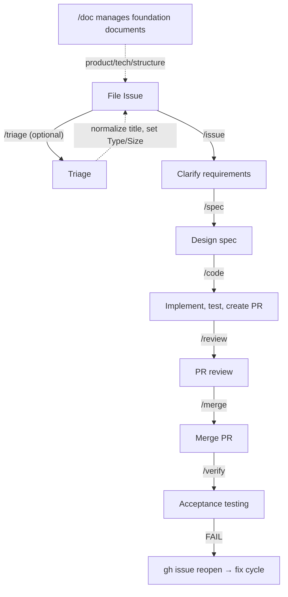

# Product

## Vision

Distribute a spec-first development workflow for Claude Code users — from Issue creation through post-merge verification — as a composable set of Skills that work on any GitHub project. Every phase (issue → spec → code → review → merge → verify) is an independent Skill that can be adopted incrementally, configured per project, and extended via adapters.

## Workflow Overview

Details: [docs/workflow.md](workflow.md)

## `/issue` (What) vs `/spec` (How) Responsibility Boundary

`/issue` and `/spec` are consecutive workflow phases, but they operate at different levels of abstraction. The table below separates their responsibilities clearly.

| | `/issue` (What: what to build) | `/spec` (How: how to build it) |
|---|---|---|
| **Describes** | User-facing requirements and behavior | Implementer-facing design and technical decisions |
| **Examples** | Acceptance criteria, use cases, constraints, background | Files to change, implementation steps, architecture choices |
| **Prohibited** | File paths, function names, implementation steps, technical detail | Adding or changing requirements (requirements are finalized in `/issue`) |
| **Output** | Updated Issue body | Spec (`docs/spec/issue-N-*.md`) |

**Decision rule**: "Can this be understood without knowing the codebase?" — Yes → `/issue` responsibility, No → `/spec` responsibility.

## Target Users

- Anyone who works on GitHub with Claude Code — not only developers, but also PMs, designers, technical writers, and other contributors who drive work through Issues and PRs

## Non-Goals

- Direct commits and pushes to the main branch (except Spec files, `/code --patch` fixes, and translated documents generated by `/doc translate`)
- Creating temporary files under `/tmp/` (use `.tmp/` within the project instead)
- Using the half-width `!` character in SKILL.md body text outside code fences

## Required Dependencies

The only hard dependencies for Wholework to function are:

- **Skills** — each Skill executed as a Claude Code Plugin
- **GitHub Issues** — the workflow's entry point and source of record for requirements
- **`docs/spec/`** — where Specs are stored. Together with GitHub Issues, these form the workflow's core. Skills create the directory automatically if absent.

Everything else is optional; each Skill falls back gracefully when optional dependencies are absent.

| Optional dependency | Fallback when absent |
|---------------------|----------------------|
| Pull Requests | Use patch route (direct commit to main). Targets XS/S size issues |
| Steering Documents (`docs/product.md`, etc.) | Skip the reference step; proceed with default behavior |
| GitHub Projects board | Skip Priority/Size project-field operations. Label-based operations (`phase/*` etc.) continue to work |

This design minimizes setup cost and allows teams to adopt individual workflow phases without committing to the full stack.

> **Implementation guideline for Skills**: always check whether an optional dependency exists before using it. If absent, skip the step or substitute a default value. Do not error out.

## Future Direction

- **`.wholework.yml` configuration customization**: Allow per-project configuration of paths such as the Spec storage location (default: `docs/spec/`). This reduces friction when adopting Wholework in projects with existing directory structures.
- **Workflow optimization (3 axes)**: Combine Agent Teams (parallel agent coordination), Model selection (different models per skill/phase), and Adaptive Thinking (dynamic reasoning depth control) to optimize workflow quality, speed, and cost.
- **Context isolation strategy (countering context rot)**: Because Spec acts as cross-phase memory, each Skill can run in a fork context without losing information between phases. Actively fork-contexting execution-phase Skills prevents context rot.
  - **Shared context** (`/issue` + `/spec`): the interactive phases where requirements and design are refined. Implicit context (reasons for rejected options, etc.) has value, so context is shared.
  - **Fork context** (`/code`, `/review`, `/merge`, `/verify`): execution phases. Each reads the required information from the Spec and runs independently. All four Skills operate in fork context.
  - **`/auto` hybrid approach**: `/auto` invokes each Skill via `run-*.sh` as `claude -p --dangerously-skip-permissions`, ensuring context isolation and full permission bypass between phases. `/auto` itself acts as a lightweight orchestrator; information passes only through Spec. When no `phase/*` label is set, `/auto` auto-starts from issue triage/refinement; when `phase/ready` is absent it auto-runs `/spec` before proceeding. `--batch N` processes N XS/S Issues from the backlog in sequence. XL Issues read the sub-issue `blockedBy` dependency graph and run independent sub-issues in parallel (worktree isolation), sequencing dependents after their blockers complete. `--base {branch}` targets a release branch instead of main.
- **Expanding target project types**: The current primary use case is application and web development, but the goal is to generalize to any GitHub project where the "Issue → spec → artifact → review" flow applies. Common thread: requirements defined in Issues, a design document, a deliverable, and a review step.
  - **Documentation / content**: technical docs, API documentation, translation projects, book authoring (GitBook-style)
  - **Data / research**: data analysis pipelines, ML model development, academic papers (LaTeX + Git)
  - **Infrastructure / IaC**: Terraform/Pulumi definitions, Kubernetes manifests, CI/CD pipeline setup
  - **OSS operations**: RFC process, CHANGELOG management, automated release notes
  - **Business / planning**: marketing campaign management, product roadmap, legal documents
- **Progressive disclosure for specialized content (Core/Domain split)**: Extract specialized content currently embedded in Skill bodies (UI design, Skill development, etc.) into auxiliary files loaded only in relevant projects. This keeps Core lightweight while enabling domain-specific extensions.
- **Adapter pattern for capability-based extension**: Abstract tool access (browser, CI, external services) behind an adapter layer and switch Skill behavior based on capability availability. Adapters operate in three steps (detect → translate command → delegate execution) and resolve in priority order: project-local → user-global → bundled. This decouples Skill bodies from specific tools, allowing the same Skill to work across different environments (with or without Playwright, with or without CI integration, etc.).

<!-- ## Success Metrics (Optional)

Describe success metrics here. -->

## Competitors / Alternatives

### SDD Frameworks / Methodologies

| Product | Nature | Spec-driven workflow | Review/Merge | Distribution |
|---------|--------|---------------------|--------------|-------------|
| [GitHub Spec Kit](https://github.com/github/spec-kit) | Spec templates and methodology | Specify → Plan → Tasks | None | CLI + templates (22+ tools) |
| [AWS Kiro](https://kiro.dev/) | IDE (VS Code fork) | requirements → design → tasks | Partial | Standalone IDE |
| [Tessl](https://tessl.io/) | SDD platform | spec → generate/describe → test | None | Framework (closed beta) + Spec Registry |
| [GSD](https://github.com/gsd-build/get-shit-done) | Meta-prompting + context engineering | discuss → research → plan → execute → verify | None | npm package (Claude Code/OpenCode/Gemini CLI) |
| [BMAD Method](https://github.com/bmad-code-org/BMAD-METHOD) | Agile AI dev framework | analyst → PM → architect → SM → dev → QA | QA agent included | npm package (21 agents, 50+ workflows) |
| [OpenSpec](https://github.com/Fission-AI/OpenSpec) | SDD framework | proposal → specs → design → tasks → apply | None | npm package (20+ tools) |
| [cc-sdd](https://github.com/gotalab/cc-sdd) | Kiro-inspired tool | requirements → design → tasks → impl | None | npm package (8 agents) |
| [Taskmaster AI](https://github.com/eyaltoledano/claude-task-master) | AI task management | PRD → parse → tasks.json → execute | None | npm package + MCP server (Cursor/Windsurf/Lovable/Roo/others) |

### Claude Code Plugins / Skills

| Product | Nature | Spec-driven workflow | Review/Merge | Distribution |
|---------|--------|---------------------|--------------|-------------|
| [feature-dev](https://claude.com/plugins/feature-dev) | Anthropic official feature dev workflow | Discovery → Codebase Exploration → Clarifying Questions → Architecture Design → Implementation → Quality Review (7 phases) | code-reviewer included | Claude Code Plugin (131K+ installs) |
| [Superpowers](https://github.com/obra/superpowers) | Skills framework | brainstorm → plan → implement | Code review skill included | Claude Code plugin |
| [Tsumiki](https://github.com/classmethod/tsumiki) | AI-driven dev framework | requirements → design → tasks → implement (+ TDD) | None | Claude Code Plugin |
| [claude-code-workflows](https://github.com/shinpr/claude-code-workflows) | E2E dev plugin | analyze → design → plan → build → verify | recipe-* for review | Claude Code Plugin (backend/frontend split) |
| [claude-code-skills](https://github.com/levnikolaevich/claude-code-skills) | Agile pipeline suite | scope → stories → tasks → quality gate | Multi-model review (Claude+Codex+Gemini) | Claude Code Plugin (7 plugins) |
| [Simone](https://github.com/Helmi/claude-simone) | Project management framework | Directory-based task management | None | Claude Code + MCP server |
| [CCPM](https://github.com/automazeio/ccpm) | GitHub Issue-integrated PM | PRD → epic → tasks → GitHub sync → parallel exec | PR workflow included | Claude Code Skills (worktree parallel execution) |
| [AgentSys](https://github.com/avifenesh/AgentSys) | Workflow automation | task → production, drift detection | Multi-agent code review | Claude Code Plugin + agnix linter |
| [spec-workflow-mcp](https://github.com/Pimzino/spec-workflow-mcp) | MCP server | Steering → Specs → Impl → Verify | Approval workflow included | MCP server + dashboard |
| [cc-blueprint-toolkit](https://github.com/croffasia/cc-blueprint-toolkit) | Blueprint-driven SDD plugin | Define → Architect → Build → Iterate (DABI) | None | Claude Code Plugin (13 skills, 8 agents) |

### GitHub Workflow Assistants / AI Code Review

| Product | Nature | Target phase | Distribution |
|---------|--------|-------------|-------------|
| [GitHub Agentic Workflows](https://github.blog/changelog/2026-02-13-github-agentic-workflows-are-now-in-technical-preview/) | GitHub official repository automation | Issue triage, PR review, CI analysis | GitHub Actions (Markdown-defined, technical preview) |
| [GitHub Copilot Code Review](https://docs.github.com/copilot) | GitHub official AI review | PR review | Copilot subscription |
| [CodeRabbit](https://coderabbit.ai/) | AI PR review service | PR review (security, logic, performance) | SaaS (GitHub/GitLab/Bitbucket/Azure DevOps) |
| [Qodo PR-Agent](https://github.com/qodo-ai/pr-agent) | OSS PR review agent | /review, /improve, /ask | GitHub Actions / CLI (OSS + paid) |
| [Graphite](https://graphite.dev/) | Stacked PR + AI review | PR management → AI review → merge queue | SaaS (GitHub only) |
| [Sweep](https://sweep.dev/) | AI GitHub issue → PR agent | Issue triage → PR creation | GitHub App (OSS + paid) |
| [Ellipsis](https://www.ellipsis.dev/) | AI PR review + auto-fix | PR review | SaaS (GitHub/GitLab, YC W24) |

### Differentiation Summary

**Wholework's differentiating points**: An end-to-end workflow centered on GitHub Issues and PRs — from spec authoring through post-merge verification — implemented entirely with Claude Code's native capabilities (Skills, CLAUDE.md). No external services or dedicated IDEs required.

Key differences from other tools:

- **Spec as cross-phase memory**: Most SDD tools treat a spec as a "planning phase artifact." In Wholework, the Spec also accumulates execution results (retrospectives) from each phase, functioning as memory across the entire workflow.
- **GitHub-native**: Issues/PRs/Labels are the workflow backbone — no dedicated IDE (like Kiro), no task-management JSON (like Taskmaster), no proprietary filesystem (like GSD's `.planning/` or BMAD's `bmad/`).
- **Size-based routing**: Automatically adjusting the patch/pr route, review depth, and spec granularity based on XS–XL size is not found in other tools.
- **Post-merge verification**: Few tools have a dedicated `/verify` phase for independent post-merge acceptance testing.

## Terms

<!-- public: terms exposed to end users / internal: implementation terms for developers -->

### Public Terms (User-facing)

| Term | Definition | Context |
|------|------------|---------|
| Skill | A Claude Code extension. Processing steps are described in `skills/<n>/SKILL.md` and invoked with `/<n>` | Claude Code |
| Spec | An implementation-plan document created by `/spec`, stored at `docs/spec/issue-N-short-title.md`. **Also records retrospectives (execution logs) after each Skill runs** — reviewing the Spec before running a Skill shows the history of prior executions | Development workflow |
| `/auto` | Orchestrator Skill that chains spec→code→review→merge→verify non-interactively via `claude -p`. Auto-starts from issue triage when no `phase/*` label is set; auto-runs `/spec` when `phase/ready` is absent. `--batch N` processes N XS/S Issues from the backlog; XL Issues execute independent sub-issues in parallel (worktree isolation). `--base {branch}` targets a release branch | Development workflow |
| Acceptance check | An HTML comment in `<!-- verify: ... -->` format. Attaches a machine-verifiable method to an acceptance condition. Formerly called "verification hint" | /issue, /verify |

### Internal Terms (Developer-facing)

| Term | Definition | Context |
|------|------------|---------|
| Steering Documents | Collective name for the foundation documents (product/tech/structure). Stored under `docs/` | /doc Skill |
| Project Documents | Workflow and operational procedure documents for the project. Stored under `docs/` | /doc Skill |
| Fork context | A Skill execution mode that does not affect the main conversation | Claude Code |
| Shared module | A procedure document stored in `modules/*.md` and referenced by multiple Skills via the "Read and follow" pattern. Formerly called "shared procedure document" | Skill development |
| Sub-agent | A sub-agent spawned via the Task tool. Returns only the result to the main agent | Claude Code |
