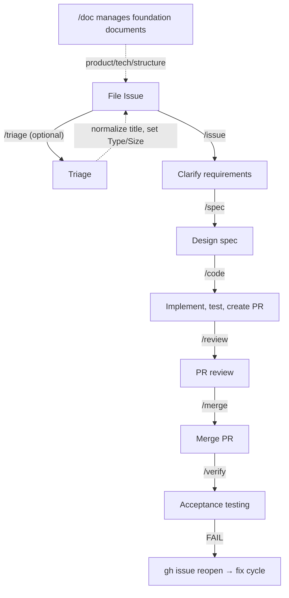

English | [日本語](ja/workflow.md)

# Development Workflow

## Overview

Overview of the development workflow using Claude Code Skills.



The main flow is `/issue` → `/spec` → `/code` → `/review` → `/merge` → `/verify`. `/auto` chains these phases automatically based on Issue Size and labels; see [Orchestration](#orchestration) for routing details.

**Size-based routing**: The Issue's Size property determines the workflow path (patch vs. PR, review depth, spec depth). See [`modules/size-workflow-table.md`](../modules/size-workflow-table.md) for the decision table (Size determination 2-axis + CI dependency check + Size→workflow mapping).

Main branch protection rules: see [CLAUDE.md](../CLAUDE.md).

## Core Phases

The six phases of the main workflow. Each phase is implemented as an independent skill. For internal skill behavior, see `skills/<name>/SKILL.md`; this section covers only the role and positioning of each phase.

### 1. `/issue` — Issue Creation

Clarifies Issue requirements. Two modes: new creation (`/issue "title"`) and existing refinement (`/issue 123`). Performs ambiguity detection, acceptance condition classification, verify command assignment, and sub-issue splitting. When refining an existing Issue without a `triaged` label, automatically chains triage execution — a single `/issue` completes both triage + issue creation for standalone Issues. Details: [`skills/issue/SKILL.md`](../skills/issue/SKILL.md)

**Responsibility boundary between `/issue` and `/spec`**: [docs/product.md — Responsibility Boundary Table](product.md#spec-design-boundary)

### 2. `/spec` — Specification

Investigates the codebase from Issue requirements and creates a Spec (`docs/spec/issue-N-short-title.md`). On design completion, performs Size→workflow routing and presents the next action based on Size (`/code --patch` / `/code`). `--light` for lightweight design (omits ambiguity resolution, uncertainty detection, self-review, etc.), `--full` for full design. When the option is omitted, auto-determines from the Size label (M → `--light`, L/XL → `--full`). Details: [`skills/spec/SKILL.md`](../skills/spec/SKILL.md)

### 3. `/code` — Implementation

Implements the design from the Spec. Size-based routing: XS/S → **patch** (direct commit to main, no PR); M/L → **pr** (branch + PR). XS skips the spec-existence check. Explicit `--patch`/`--pr` flags override auto-detection.

Three implementation paths:
- **Claude Code**: `/code 123` for local implementation
- **GitHub Copilot**: Select "Assign to Copilot" in the Issue
- **Manual**: User implements manually

**Spec reference**: During implementation, reference the Spec saved at `docs/spec/issue-N-short-title.md`. The Spec contains target files, implementation steps, and verification methods. If no Spec exists, read requirements from the Issue body.

Details: [`skills/code/SKILL.md`](../skills/code/SKILL.md)

### 4. `/review` — Review

Integrates PR acceptance criteria verification, multi-perspective code review, and issue resolution. MUST findings are auto-fixed before proceeding to `/merge`. Details: [`skills/review/SKILL.md`](../skills/review/SKILL.md)

**Review mode**: Auto-determined based on Size (Project field preferred → label fallback). Can also be explicitly specified with `--light`/`--full`.

| Size | Review mode | Behavior |
|------|-------------|----------|
| XS, S | skip (early exit) | Exits with "review not required" message (patch route) |
| M | light | Runs Step 10 as lightweight integrated review (1 agent) |
| L, XL | full | Runs all steps |

**External review tool integration**: Create `.wholework.yml` at the project root and set values to enable (all disabled by default):

```yaml
# .wholework.yml
copilot-review: true        # Enable GitHub Copilot review (wait and handle findings in Step 7)
claude-code-review: true    # Enable official Claude Code Review (wait and handle findings in Step 7)
coderabbit-review: true     # Enable CodeRabbit AI review (wait and handle findings in Step 7)
review-bug: false           # Disable review-bug agent in Step 9 (only review-spec runs)
```

If `.wholework.yml` does not exist, all settings are treated as default (disabled).

**`--review-only` option**: `/review {PR number} --review-only` stops after multi-perspective code review (Step 10) and skips Steps 11–14 and retrospective. Fixes are delegated to the user or Copilot. The `phase/review` status label remains unchanged.

### 5. `/merge` — Merge

Executes squash merge and deletes the remote branch. Attempts automatic conflict resolution if conflicts exist. Details: [`skills/merge/SKILL.md`](../skills/merge/SKILL.md)

### 6. `/verify` — Acceptance Testing

Automatically verifies post-merge acceptance conditions. All conditions PASS completes the flow; on FAIL, `gh issue reopen` returns to the fix cycle. Performs a cross-phase retrospective review of all phases, always creates Issues for code improvements, and creates Issues for skill infrastructure (Wholework) improvements only when `.wholework.yml` has `skill-proposals: true`. Details: [`skills/verify/SKILL.md`](../skills/verify/SKILL.md)

## Orchestration

### `/auto` — Full Workflow Automation

Orchestrator that chains Core Phases sequentially, running each as an independent `claude -p --dangerously-skip-permissions` process for context isolation. `/auto 123 [--patch|--pr] [--review=full|--review=light]` drives the end-to-end workflow with Size-based routing:

- **patch XS/S**: spec (if needed) → code → verify
- **pr M/L**: spec (if needed) → code → review (M → `--light`, L → `--full`) → merge → verify
- **XL**: reads the sub-issue dependency graph (`blockedBy`) and runs independent sub-issues in parallel (worktree isolation), sequencing dependents after their blockers complete. `/auto` auto-executes spec for each sub-issue.

If `phase/ready` is absent, `/auto` auto-runs `/spec` first. If no `phase/*` label is set, it starts from issue triage/refinement. Details: [`skills/auto/SKILL.md`](../skills/auto/SKILL.md)

**`--batch N`**: Bulk-processes N XS/S Issues from the backlog in newest-first order.

**Release branch workflow (`--base` option)**: Use `--base` to consolidate multiple Issue changes on a release branch (e.g., `release/v2.0`) before merging to main.

```
# Create release branch
git checkout -b release/v2.0 main
git push origin release/v2.0

# Implement each Issue on release/v2.0 base
/code 123 --base release/v2.0
/auto 124 --base release/v2.0

# Final merge: release/v2.0 → main is handled with the standard /code → /review → /merge flow
```

When `--base` specifies a branch other than main, `closes #N` does not auto-close Issues (GitHub only works when merging to the default branch). Close Issues manually at the final merge of `release/v2.0` into main, or run `gh issue close` manually.

## Supporting Skills

Skills that operate outside the main Issue → verify flow. They maintain metadata, foundation documents, and codebase health rather than driving individual Issue execution.

### `/triage` — Metadata Assignment

Assigns Type (`bug`/`feature`/`task`), Size (XS–XL), and Priority to Issues. Independent of `phase/*` labels. `/triage --backlog` (no perspective) runs bulk unprocessed triage + all 4 deep-analysis perspectives together. When a perspective is specified (e.g., `--backlog value`), only that perspective's analysis runs without assigning `triaged`. An approval flow is displayed before each perspective is applied. Details: [`skills/triage/SKILL.md`](../skills/triage/SKILL.md)

`/auto` chains `/triage` automatically for Issues without a `phase/*` label.

### `/doc` — Foundation Document Management

Maintains project foundation information in `docs/`. Each document declares its role via the YAML frontmatter `type` field (`type: steering` for Steering Documents, `type: project` for operational documents). `/doc sync` identifies both types and normalizes them. `/doc sync --deep` adds codebase analysis (entry points, dependency graphs, test files, comments/docstrings) plus integrated scanning of existing .md files (4-pattern classification, absorption target determination) plus structural antipattern detection (SSoT Reverse Reference, Pointer-only Section, Skill Coverage Gap). `/doc init --deep` and `/doc {doc} --deep` perform equivalent inline analysis for new files, auto-generating drafts without a question flow. `/doc translate {lang}` generates translations of English documentation (README.md, Steering Documents, Project Documents) under `docs/{lang}/` and `README.{lang}.md`, then commits and pushes automatically. Details: [`skills/doc/SKILL.md`](../skills/doc/SKILL.md)

**Translation Sync**: `docs/*.md` and `docs/guide/*.md` have 1:1 counterparts under `docs/ja/` (`docs/ja/*.md` and `docs/ja/guide/*.md`). To check which files are out of sync, run:

```sh
bash scripts/check-translation-sync.sh
```

To regenerate all translations, run `/doc translate ja`. This command generates updated Japanese translations for all English documentation and commits them automatically.

### `/audit` — Drift and Fragility Detection

`/audit drift` uses AI to detect semantic drift between Steering Documents + Project Documents and codebase implementation, automatically generating Issues for code-side fixes. For best results, run `/doc sync --deep` first to normalize document-side drift; then run `/audit drift` to detect remaining semantic drift that requires code-side fixes. `/audit fragility` detects structurally fragile areas (missing tests for core modules, Architecture Decision violations, etc.) and generates risk-improvement Issues. `/audit` (no arguments) runs both drift + fragility perspectives together. `/audit stats` aggregates Issue metadata (throughput, composition, First-try success rate, Backlog Health, etc.) across the project and generates a project health diagnostic report, serving as a third lens alongside drift and fragility. Details: [`skills/audit/SKILL.md`](../skills/audit/SKILL.md)

## Label Management

Uses `phase/*` labels to visualize Issue progress. Each skill automatically manages labels as the workflow advances.

Setup: Wholework automatically creates the labels it needs on first run. Manual label creation is not required for Plugin users. To force re-create all labels, run `scripts/setup-labels.sh` manually.

### Label Transition Map

| Label | Meaning | Assigned by | Removed by |
|-------|---------|-------------|------------|
| `phase/issue` | Issue creation phase | `/issue` | `/spec` |
| `phase/spec` | Specification phase | `/spec` (on start) | `/spec` (after spec push) |
| `phase/ready` | Design complete, awaiting implementation | `/spec` (after design push) | `/code` |
| `phase/code` | Implementation phase | `/code` | `/review` |
| `phase/review` | Review phase | `/review` | `/merge` |
| `phase/verify` | Acceptance test phase | `/merge` | `/verify` |
| `phase/done` | Complete | `/verify` (no post-merge conditions) | — |
| (no label) | Backlog / not started | — | `/verify` (on FAIL) |

### XL Parent Issue Phase Management

XL (sub-issue split) parent Issues have their phase automatically aggregated based on child Issue progress.

| Child state | Parent phase | Notes |
|-------------|-------------|-------|
| 1+ children at `phase/code` or later | `phase/code` | Implementation in progress |
| All children at `phase/verify` or later | `phase/verify` | Awaiting verification |
| All children `phase/done` + no parent conditions | `phase/done` + close | Auto-close |
| All children `phase/done` + parent conditions exist | `phase/verify` | Final confirmation by `/verify` before close |

Aggregation updates run at each level completion in `/auto` XL orchestration.

### Standard Flow via `closes #N`

Adding `closes #N` to PR body auto-closes the Issue on merge (GitHub standard feature).

```
/code: Add `closes #N` to PR body
  ↓
/merge: Merge → Issue auto-closes
  ↓
/verify: Verify closed Issue
  - PASS → Complete (remove phase/verify label)
  - FAIL → gh issue reopen + remove all phase/* → return to fix cycle
```

### Verify Fail Flow

When `/verify` detects a FAIL among auto-verification targets, it reopens the Issue and removes all `phase/*` labels. The user then selects the next action manually:

```
/verify FAIL → gh issue reopen + remove all phase/*
  ↓
User selects:
  - /code --patch N  — fix with direct commit to main (small fix, Size unchanged)
  - /code --pr N     — fix with new branch + PR (larger fix, Size L)
  - /spec N          — revisit design (when root cause requires redesign)
  ↓
/verify N  (re-verify after fix)
```

The original `size/*` label is preserved throughout (not modified). `get-issue-size.sh`'s two-layer lookup (Project field → `size/*` label) retains the original Size across reopen/close cycles, so `/audit stats` Size-based analysis remains accurate.

### When Auto-close is Disabled

When the GitHub repository setting "Auto-close issues with merged linked pull requests" is disabled, Issues remain OPEN after merge even when the PR body contains `closes #N`.

`/verify` detects the Issue state at runtime (`gh issue view --json state`) and applies a different close flow:

```
/code: Add `closes #N` to PR body (same as standard flow)
  ↓
/merge: Merge → Issue remains OPEN (auto-close is disabled)
  ↓
/verify: Detect Issue OPEN state
  - All auto-verify PASS + all conditions checked → phase/done + gh issue close
  - All auto-verify PASS + opportunistic/manual unchecked → phase/verify (Issue stays OPEN)
    → User manually checks remaining conditions, then re-runs /verify N
  - FAIL/UNCERTAIN → Remove phase/* labels (Issue stays OPEN; return to fix cycle)
```

### Triage-Related Labels

| Label | Meaning | Assigned by |
|-------|---------|-------------|
| `triaged` | Triaged | `/triage` |
| `type/bug` | Type: bug | `/triage` |
| `type/feature` | Type: feature | `/triage` |
| `type/task` | Type: task | `/triage` |

### Audit-Related Labels

| Label | Meaning | Assigned by |
|-------|---------|-------------|
| `audit/drift` | Fix Issue for drift detected by `/audit drift` | `/audit` |
| `audit/fragility` | Improvement Issue for structural fragility detected by `/audit fragility` | `/audit` |

### Projects Integration

`.github/workflows/kanban-automation.yml` implements auto Kanban column movement by `phase/*` labels. `phase/issue`, `phase/spec` → Plan, `phase/ready` → Ready, `phase/code` → Implementation. Review/Verification/Done use Projects built-in automations.

## Related Documents

- [CLAUDE.md](../CLAUDE.md) — Global guidelines
- [README.md](../README.md) — Project overview and install
- [docs/product.md](product.md) — Project vision, non-goals, terminology
- [docs/tech.md](tech.md) — Tech stack, architecture decisions, coding conventions
- [docs/structure.md](structure.md) — Directory structure, Key Files, agents/modules catalog
- [docs/guide/workflow.md](guide/workflow.md) — User-facing workflow guide
